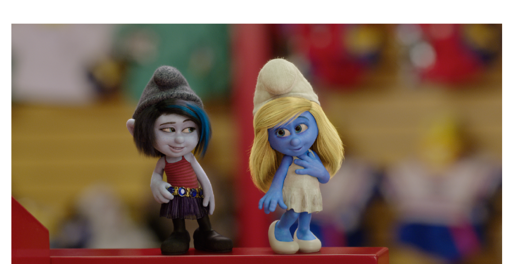
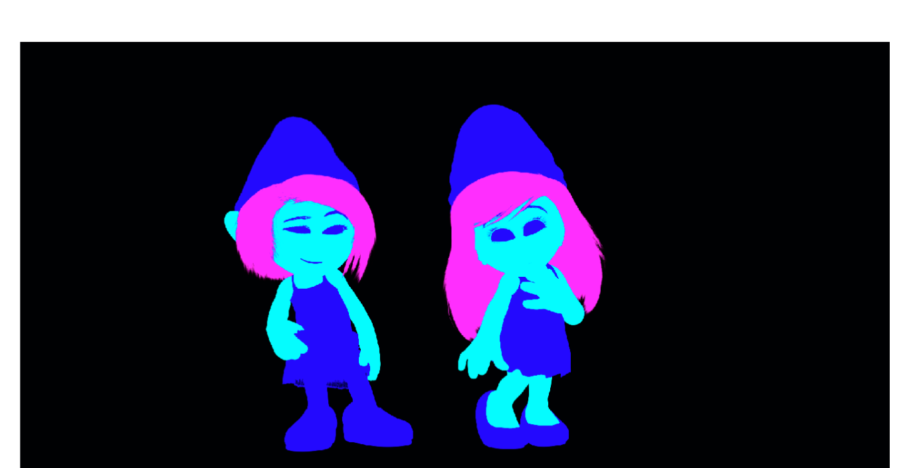

# An Overview of Digital Intermediates

Digital intermediate color grading is now far past its infancy and is the standard method
for finishing feature films. In years past, film negative was cut, spliced, and timed by a color
timer at the lab. Thanks to advances in digital technology, feature films can be color graded
with much greater flexibility and control than before, and without generation loss or successive
image degradation. It is a non-destructive, non-linear, creative process that frees filmmakers to
work more organically.

It is often debated whether the term "digital intermediate" still has relevance, as fewer films
originate on film negative and even fewer exhibit on film prints. However, it arguably does
retain merit, as it is the central nexus where all forms of digital acquisition must funnel through
before the myriad digital distribution deliverables can be made. This confluence of formats,
resolutions, and bit depths is managed and streamlined during the digital intermediate process.

## Responsibilities of the Colorist

The colorist is a visual artist with an experienced eye and a skillset that blends the visual
narrative continuity strengths of a cinematographer and the problem solving skills of a VFX
compositor. Their eye is on the big picture, both literally and figuratively. They are responsible
for crafting the final look of the film with the filmmakers on a theatrical projector (or large
television if it is not a theatrical film). They manage color continuity so the film has a
cohesiveness that is natural and enjoyable to watch. This involves color matching and balancing
shots that otherwise would not match due to inevitable camera, lighting, or other
environmental discrepancies.

They are heavily involved in developing the look of the film. This is ideally a collaboration that
begins early in pre-production as the cinematographer performs camera, lighting, and
wardrobe tests. They want to see what the results are when projected on the big screen and
what kind of creative latitude they have to express that image in a different way. Colorists can
weigh in and help a cinematographer choose a camera based on the specific visual
requirements of the film. The digital intermediate is an extension of the cinematographer's
toolset, and the colorist can interactively explore different creative looks and moods, both
subtle and extravagant.

## Camera RAW

As the digital intermediate shoulders the responsibility of uniting many disparate camera and
image formats, it is common for camera original media to be processed natively during the
digital intermediate. Most modern digital cinema cameras rely on a form of RAW encoding,
collecting raw sensor data and preserving it for creative interpretation at a later time. This
presents many advantages over a traditional video workflow where colorimetric decisions are
pre-baked into the footage during acquisition, confining you to a specific look whether
intentionally or not.

Common examples of such cameras recording in a RAW format include:

| Camera | RAW format |
| --- | --- |
| ARRI ALEXA | ARRIRAW |
| RED Digital Cinema | R3D |
| Sony CineAlta F5 / F55 / F65 | SonyRAW or X-OCN |
| Canon C500 | Canon RAW |
| Panasonic VariCam 35 / LT | VRAW |
| Blackmagic Design digital film cameras | CinemaDNG |

!!! warning "Out of date"
    This table reflects the 2017 camera market. Most of these bodies are now legacy, and
    Blackmagic replaced CinemaDNG with Blackmagic RAW (BRAW) in 2018. See
    [Notes for v1.1](v1.1-notes.md#cameras-and-raw-formats) for the current landscape.

Camera RAW recording has become a ubiquitous standard in studio productions. Camera RAW
allows for greater workflow flexibility later in post while preserving the maximum image
resolution and quality the camera can produce. However, with added options comes added
potential for misinterpretation of the image data that can prove detrimental to the final
product.

The added flexibility of user-selectable color spaces and transfer functions requires diligence
and expertise to properly manage. It is not uncommon to hear of independent productions
where visual effects clip pulls are accidentally decoded using incorrect color spaces or transfer
functions. The worst case scenario is one in which the pulls are performed in a display-referred
setting, reducing the original dynamic range of the camera through a tone map. If this issue is
not identified early, it runs the risk of making it all the way through the VFX pipeline. Once the
shot finally makes it back to the digital intermediate, the colorist and the filmmakers will find
those shots severely limited and may be unable to match the creative look of the rest of the
scene.

Expertise in color management is necessary to properly maintain a film's image pipeline
integrity from acquisition all the way through to distribution. It isn't rocket science — it is color
science! When in doubt, involve your colorist or digital intermediate facility during
pre-production or production to sort out issues.

## Scene-Referred vs. Display-Referred (Output-Referred) Imagery

There are two primary image states with which we can categorize most images as they pertain
to digital production workflows.

!!! quote
    "We categorize color spaces by the 'direction' of this relationship to real world
    quantities, which we refer to as image state. Color spaces which are defined in
    relation to display characteristics are called display-referred, while color
    spaces which are defined in relation to input devices (scenes) are scene-referred."

    — Jeremy Selan, Sony Pictures Imageworks, *Cinematic Color VES*, 2012

### Display-Referred Imagery

We are most familiar with display-referred images. Images we commonly view on the web, our
phones, on a television, or in a movie theater are display-referred. These are images which are
numerically described based on their relationship to the way they are represented on a given
display. These images no longer have a numeric relationship to real-world exposure values. A
display-referred image can be accurately represented on a target display without the need for
any additional conversions or look-ups. It is very much a what-you-see-is-what-you-get
scenario.

Almost all reference displays have a built-in gamma encoding. These encodings are different
depending on the display, its usage and intention, and the assumed viewing environment. For
example, an sRGB image on a computer monitor or phone display is roughly gamma 2.2, while
home video Rec.709 mastering is encoded at gamma 2.4 or BT.1886, and standard dynamic
range digital cinema is encoded at gamma 2.6.

!!! warning "Technically imprecise"
    Describing Rec.709 as having an "implied gamma of 2.4" conflates the camera-side OETF
    with the display-side EOTF. See [Notes for v1.1](v1.1-notes.md#rec709-and-the-oetfeotf-conflation).

In analog terms, a display-referred image is our film print.

An image intended for exhibition will ultimately be display-referred.

### Scene-Referred Imagery

If display-referred imagery is our ultimate goal for exhibition, why is scene-referred imagery
important?

Scene-referred imagery is not encoded to produce a desirable result on a display. Rather it is
designed to encode values that correspond to real-world exposure values of a given "scene."
("Scene" can refer to a real-life scene in front of a camera or a virtual one in front of a CG
camera.) Scene-referred imagery does not equate pixel values with absolute measures of light,
only relative measures of light. For example, a camera sensor cannot measure how many
photons are reflected from an object in a given period, but it can quantify the brightness of a
reference object compared to another in the scene. The relative relationship of light values in
the scene is described in scene-referred imagery.

Scene-referred images in the context of digital cinema workflow are any camera original images
(or visual effects shots encoded in camera original encoding) that retain the camera's native
dynamic range and tonal response.

Camera RAW images are inherently scene-referred, while traditional video images are
display-referred.

Scene-referred images can come in two major flavors: scene-linear (linear light space) or any
number of camera log encoding schemes (such as REDlogFilm, LogC, Canon Log, S-Log3).

### Scene-Linear

Scene-linear encoding is a purely linear (no gamma) encoding of relative light values, expressed
in floating point values. Middle grey is mapped to 0.18 and each stop of light doubles upon that
and may exceed 1.0. Scene-linear images are commonly written to 16-bit OpenEXR files rather
than historically integer-based formats like DPX or QuickTime.

Scene-linear is not to be confused with normalized linear, or camera linear, which are float or
integer encoded values ranging from 0.0 to 1.0 and correspond directly to a camera's sensor
raw analog-to-digital output values prior to encoding.

### Camera Log

Logarithmic encoding is a method designed to express scene-referred imagery within a smaller
or more convenient data type. In order to represent the dynamic range of modern film negative
or digital cinema cameras without quantization, 16-bit encoding is necessary when encoding in
scene-linear. By encoding scene data logarithmically (describing relative intensities of light in
terms of stops rather than linear values) the same dynamic range can be encoded to a lower bit
depth like 10-bit or 12-bit. There are many historical reasons integer-based image encoding was
important. Most of those are irrelevant now, and modern digital intermediate systems are fully
compatible with 16-bit floating point images. It can, however, still be more convenient to use
log-based integer encodings.

As the dynamic range of new cameras increases, the need for 16-bit image encoding increases.
10-bit log is insufficient for incredibly high dynamic range encodings, as it can produce
quantization artifacts (or banding) if too much dynamic range is compressed into a small range
of code values. This is particularly problematic in EDR (extended dynamic range, theatrical) and
HDR (high dynamic range, home video) mastering. In those situations 12-bit log should really be
the minimum bit depth of camera original images, with 16-bit log or 16-bit scene-linear being
ideal.

The major reason we still use logarithmically encoded images is that it allows us to capture
scene-referred imagery to a variety of convenient formats without the overhead of Camera
RAW. ARRI ALEXA, ARRI AMIRA, RED WEAPON, and many Blackmagic cinema cameras allow for
native ProRes capture, while Sony F5/F55/F65 allow native capture to other raster image
formats like XAVC and SStP (Sony SR File). External recorders provide even more options for
capturing scene-referred imagery without Camera RAW.

As Camera RAW typically exhibits higher data rates than ProRes and necessitates more
intensive dailies processing, Camera RAW may be an expensive luxury for some productions. In
particular, broadcast television productions rarely utilize the full benefits of RAW and instead
record in a camera log based format like ProRes at a convenient resolution and format.

Camera log images are analogous to log film scans and fit in with established workflows very
easily.

### Video ≠ Linear

You won't receive many impassioned pleas from this document. But this is one! An
embarrassingly common misconception (or casual misuse of the terminology) is usage of the
shorthand term "linear" in reference to "video" images. Many people who should know better
refer to a Rec.709 display-referred video image as "linear." It is patently false to call an image
with a gamma "linear." Display-referred images are almost always gamma referred, so they are
by definition not linear.

People make this misconception because if there were to be an opposite to logarithmic in this
context it would be linear, and, well, standard dynamic range display-referred images aren't
logarithmic… so one could mistake them for "linear."

In many casual conversations this misuse is benign, as professionals usually understand what
you mean by "linear." However, in the context of visual effects production, color management
planning, and delivery specifications this imprecision can be very costly.

!!! example
    When a client tells you they are providing "linear plates" you would naturally expect a
    scene-linear, scene-referred workflow centered around OpenEXRs. But if they really mean
    video, not linear, there are some serious ramifications for your visual effects and color
    grading workflow.

    Casually, people often refer to concrete and cement to mean the same thing. But if a
    builder ordered 100 lbs of cement and 100 lbs of concrete, they would receive two very
    different things that, while related, require a certain specificity when it comes to
    purchasing.

## Look Up Tables (LUTs)

LUTs are pre-computed color transformations that can contain technical color space
conversions, or creative transformations from scene-referred to display-referred states.

### Creative Transformations

The umbrella of creative transformations includes any s-shaped curves used to tone map a
scene-referred image into a desirable display-referred image. These transforms are subjectively
designed to give the image an aesthetic look. Any time you are viewing a camera image in a
display-referred setting (e.g. ALEXA camera monitoring in Rec.709 on a studio monitor or
viewfinder) you are viewing through a creative transformation.

Film print emulations and other stylistic color correction looks can be baked into LUTs for
convenient use and exchange between various software and hardware.

We commonly reference a scene-to-display transform as a "forward" function, while we refer
to any display-to-scene transform as an "inverse" function. While it is possible to derive
inverses of many functions, once an image undergoes an s-shaped transformation in which
values are clipped or multiple input values mapped to a single output value, the inverse will not
yield the full dynamic range or a true scene reference.

Inverses are commonly used for converting display-referred graphics so they appear correct
when viewed under a global Show LUT, or to convert a display-referred image to log for
film-out.

### The Show LUT

The Show LUT, referred to often in this document, is a type of creative display reference
transformation. Its major distinction is that it is the singular scene-to-display
transformation decided upon for a given project. In many theatrical grading examples, all
grading operations occur underneath (or prior to) that LUT. This LUT is used on set to drive
video village monitor previews and is essentially the digital equivalent of the print stock. There
are endless possible creative transformations and there is no singularly "correct" or ideal
transformation. It is important for the filmmakers and the colorist to work together to choose a
Show LUT, or design one themselves, that they feel best represents the camera material, as shot
by the cinematographer, in an ideal way in accordance with the project's particular aesthetic
values. This means shaping an s-curve to tone map scene-referred values in an aesthetically
driven way and may include color gamut reshaping through a film print emulation if desired.

Show LUTs are display-referred, so they are intended for specific mastering displays and color
spaces. Variations of the Show LUT will be tailored for the various display methods and
deliverables applicable to a given project (e.g. Rec.709, DCI-P3, Rec.2020).

Examples of common creative transformations:

- ARRI LogC to Rec.709 (K1S1)
- `Slog3SGamut3.CineToLC-709TypeA`
- REDlogFilm to REDgamma4

### Technical Transformations

Typically, transformations that do not cross the barrier between scene-referred and
display-referred image states are "technical" transformations. Technical transformations rely on
published math formulas and defined standards, so there is no subjectivity involved.

Technical transformations on display-referred images are necessary to convert between
different display types (e.g. digital cinema to home video).

A common display-referred technical transformation:

```
Rec.709 / Gamma 2.4  →  DCI-P3 / Gamma 2.6
```

Similarly, transformations on scene-referred data can convert from camera log to scene-linear,
for compositing, and back again without compromising meaningful colorimetric data.
Additionally, it is possible to convert from one camera's native log encoding and color space
into another.

A common scene-referred technical transformation:

```
Sony S-Log3 / S-Gamut3  →  ARRI LogC / ALEXA Wide Gamut
```

This can be particularly helpful in maintaining color continuity when intercutting different
cameras in the same scene. Even more helpful when multiple VFX plates are shot from different
types of cameras for the same shot and the comparable colors are expected to match. It is
common for feature productions involving multiple cameras to pre-transform their visual
effects plates during clip pulls, and relevant original camera footage in the DI timelines.

When intercutting Camera RAW with scene-linear OpenEXR visual effects shots, it is common to
transform the scene-linear visual effects into the camera log encoding (or vice versa) to
maintain continuity in the working environment. This makes the visual effects shots match the
original camera media and allows for grades to be copied between VFX shots and non-VFX
shots with predictable results.

### LUT Tools

Most modern color grading systems are capable of generating LUTs based on creative or
technical transformations. However, every developer has its preferred LUT format, and many
LUT formats are not cross-compatible with all of the systems commonly in use. When working
with multiple artists, editors, vendors, and colorists at different companies, it's important to be
able to exchange commonly needed LUTs (like the Show LUT) in formats that work on
everyone's various platforms.

Apps like [Lattice](https://videovillage.com/lattice/) and
[LightSpace CMS](https://www.lightillusion.com) are useful for converting LUTs for use in a
variety of systems and applications. Additionally, they are capable of performing a multitude of
technical transformations and color space conversions. These precise transformations are often
difficult to do accurately using normal grading tools.

!!! warning "Out of date"
    LightSpace CMS has been superseded by ColourSpace. See
    [Notes for v1.1](v1.1-notes.md#lut-and-calibration-tools).

## Working with Visual Effects Mattes

When grading visual effects shots, it is often helpful to have mattes provided by the visual
effects artists and vendors to enable easy and accurate isolation of CGI elements, foregrounds, and
backgrounds in the composite. By utilizing the detailed mattes that were used in the
compositing process, a colorist can execute detailed color corrections very quickly without
resorting to complex rotoscoping, keying, and tracking that may otherwise be too time
consuming.

Mattes are delivered in the same working format and resolution as the delivered composite.
Typically, mattes are limited to three channels (RGB) and should be delivered in a normalized
linear encoding.[^4] Alternatively, OpenEXR supports multiple channels in addition to the primary
RGB layer. So mattes intended for the DI can actually be combined and delivered in the same
file as the comp, reducing conform time.

[^4]: 0.0–1.0 representing a percentage of opacity. Log mattes produce undesirable results or
      require pre-conversion to linear.

<figure markdown>
  { loading=lazy }
  <figcaption>Figure 2 — RGB composite.</figcaption>
</figure>

<figure markdown>
  { loading=lazy }
  <figcaption>Figure 3 — Three-channel DI matte.</figcaption>
</figure>

<figure markdown>
  { loading=lazy }
  <figcaption>Figure 4 — Three-channel DI matte (separated RGB channels).</figcaption>
</figure>
