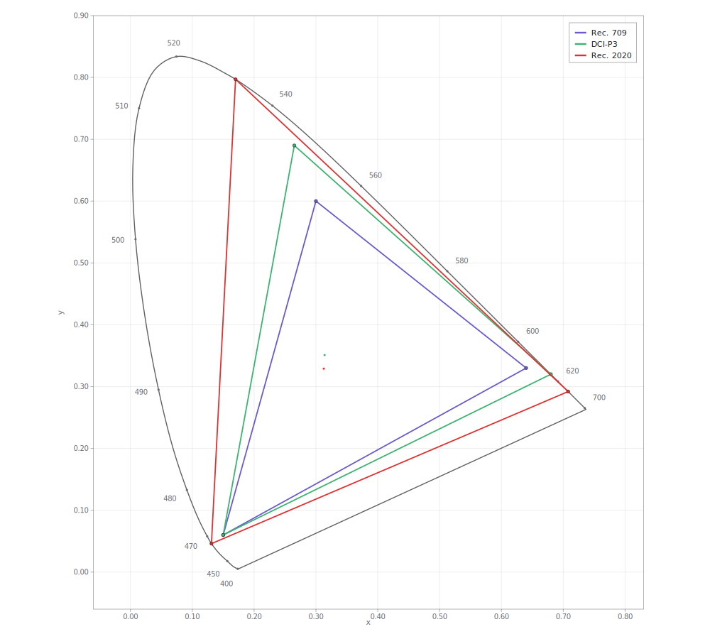
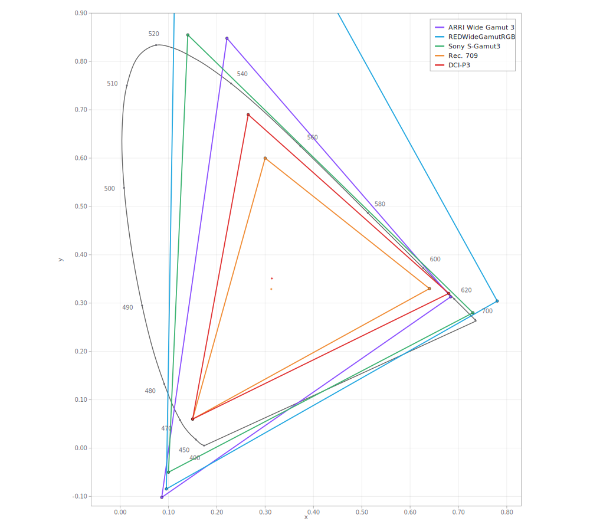

---
tags:
  - draft
  - review
---

# Figure Review — Chromaticity Diagrams

!!! info "Review document — not part of the handbook"
    Side-by-side comparison of the original v1.0.1 chromaticity diagrams against SVG
    replacements generated with [Color Plotter](https://ditools.videovillage.com/color_plotter).
    Nothing here has replaced anything in the chapters. Approve or reject per figure.

The two chromaticity figures are the strongest candidates for replacement with vector art:

- They are the **lowest-resolution figures in the document** (1075x1054 and 896x954 native), and
  cannot be improved by re-extraction because that is the resolution of the original artwork.
- They are pure line art with text — exactly what SVG is for. At any zoom the labels stay sharp,
  and the file is ~15 KB instead of ~650 KB.
- Their content is *derived*, not authored: a chromaticity diagram is fully determined by the
  primaries. Regenerating them from a current tool means the numbers can be verified rather than
  trusted.

## How these were generated

Rendered headlessly from Color Plotter's own scene/SVG modules, so the output is identical to
what the web tool exports:

```js
import { buildScene, fitPlotSize } from 'src/lib/colorplot/scene.js';
import { renderSVG }               from 'src/lib/colorplot/render_svg.js';

const scene = buildScene(project, view);
const svg   = renderSVG(scene, 1);
```

CIE 1931 xy, light theme, transparent background, locus with wavelength ticks, legend on.
The generation script is reproducible and can be re-run if the palette or viewport needs changing.

---

## Figure 18 — Display color spaces

=== "Original (v1.0.1)"

    

    1075x1054 px · 663 KB · raster

=== "SVG replacement"

    

    vector · 14 KB · scales to any size

**Plots:** Rec. 709, DCI-P3, Rec. 2020 — matching the original exactly.

### Primaries used

| Space | Red | Green | Blue | White |
| --- | --- | --- | --- | --- |
| Rec. 709 | 0.640, 0.330 | 0.300, 0.600 | 0.150, 0.060 | D65 |
| DCI-P3 | 0.680, 0.320 | 0.265, 0.690 | 0.150, 0.060 | DCI |
| Rec. 2020 | 0.708, 0.292 | 0.170, 0.797 | 0.131, 0.046 | D65 |

The Rec. 2020 values match ITU-R BT.2100-2 Table 1 exactly. Rec. 709 matches BT.709, and DCI-P3
matches SMPTE RP 431-2. **The original figure's geometry agrees with these** — the two renderings
put the primaries in the same places.

---

## Figure 19 — Camera and delivery color spaces

=== "Original (v1.0.1)"

    

    896x954 px · 668 KB · raster

=== "SVG replacement"

    

    vector · 16 KB · scales to any size

**Plots:** ARRI Wide Gamut 3, REDWideGamutRGB, Sony S-Gamut3, Rec. 709, DCI-P3 — matching the
original's five traces.

### Primaries used

| Space | Red | Green | Blue | White |
| --- | --- | --- | --- | --- |
| ARRI Wide Gamut 3 | 0.684, 0.313 | 0.221, 0.848 | 0.0861, −0.102 | D65 |
| REDWideGamutRGB | 0.780308, 0.304253 | 0.121595, 1.493994 | 0.095612, −0.084589 | D65 |
| Sony S-Gamut3 | 0.730, 0.280 | 0.140, 0.855 | 0.100, −0.050 | D65 |
| Rec. 709 | 0.640, 0.330 | 0.300, 0.600 | 0.150, 0.060 | D65 |
| DCI-P3 | 0.680, 0.320 | 0.265, 0.690 | 0.150, 0.060 | DCI |

Note the **negative blue y coordinates** and REDWideGamutRGB's green at **y = 1.494**. These are
non-physical virtual primaries — exactly the point the
[Camera Color Spaces](../color.md#camera-color-spaces) section makes. Neither the original nor
the SVG shows RED's green primary, because it sits far above the plotted region; both crop it.
Worth deciding whether v1.1 should extend the viewport to include it, since a reader may wonder
where the cyan lines are going.

---

## Differences to decide on

These are genuine differences between the original and the replacement, not errors. Each is your
call.

### 1. No spectral fill

The originals have the familiar rainbow wash inside the horseshoe. **The SVG does not, by
design** — Color Plotter's SVG backend is vector-clean and omits the per-pixel spectral fill,
which only exists in the Canvas/PNG path.

This is the one substantive visual difference. Options:

- **Accept it.** The wash is decorative; the figure's information is in the traces and the locus.
  A clean diagram arguably reads better in a technical document, and prints better.
- **Export PNG from Color Plotter instead**, which keeps the spectral fill but returns you to
  raster — though at whatever resolution you choose, so still a large improvement on 1075 px.
- **Keep the originals.** They are legible; they are simply low-resolution.

### 2. Naming

The original Figure 19 legend reads **"AlexaWideGamut"**. The SVG uses **"ARRI Wide Gamut 3"**,
which is the current name and distinguishes it from AWG4 (introduced with the ALEXA 35). Since
[Notes for v1.1](../v1.1-notes.md#cameras-and-raw-formats) already recommends normalising to
ARRI's current styling, the rename is consistent — but it is a change from the original.

### 3. The chapter table lists a space the figure never plotted

[Camera Color Spaces](../color.md#camera-color-spaces) lists four spaces: ARRI Wide Gamut,
**RED DRAGONcolor2**, REDWideGamutRGB, and Sony S-Gamut3. Figure 19 plots ARRI, REDWideGamutRGB,
S-Gamut3 — **and not DRAGONcolor2** — plus two delivery spaces the table does not mention.

This is a pre-existing inconsistency in v1.0.1, not something introduced here. Since the figure
is being regenerated anyway, v1.1 could resolve it by either adding DRAGONcolor2 to the plot or
dropping it from the table. Given RED's current line has moved to REDWideGamutRGB, dropping it
is probably right.

### 4. Colour assignments

Trace colours were chosen to echo the originals (Rec. 709 blue/violet, DCI-P3 red, Rec. 2020 red
in Fig. 18; ARRI violet, RED cyan, Sony green in Fig. 19) but they are not sampled matches. Easy
to adjust — say the word and I will match them precisely, or move to a palette that is
colour-blind safe, which the current red/green pairing is not.

### 5. Viewport

The SVGs use a slightly wider view than the originals so no trace touches the frame edge except
RED's green. If you would rather they match the original crop exactly, that is a one-line change.

---

## Recommendation

Adopt both SVGs **if** you are content to lose the spectral wash. The accuracy is verifiable, the
files are 40x smaller, they stay sharp at any zoom, and they can be regenerated whenever a
primary set changes — which matters given that ARRI, RED, and Sony have all revised their color
science since 2017.

If the wash matters to you, the better path is a high-resolution PNG export from Color Plotter
rather than keeping the 2017 raster.
