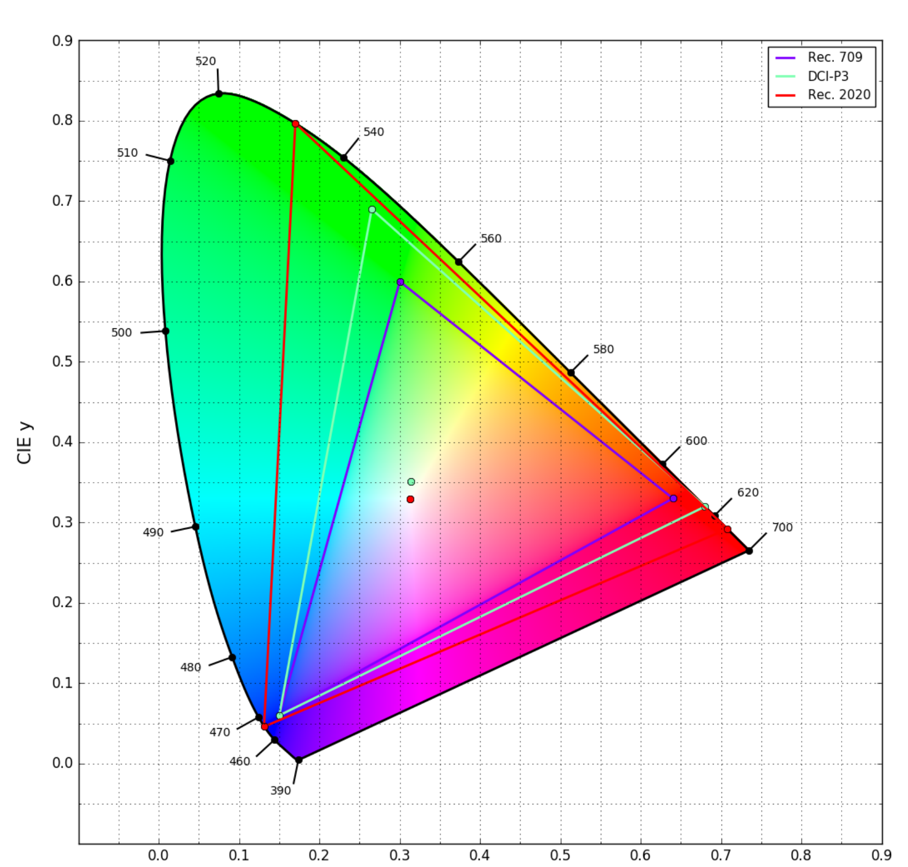
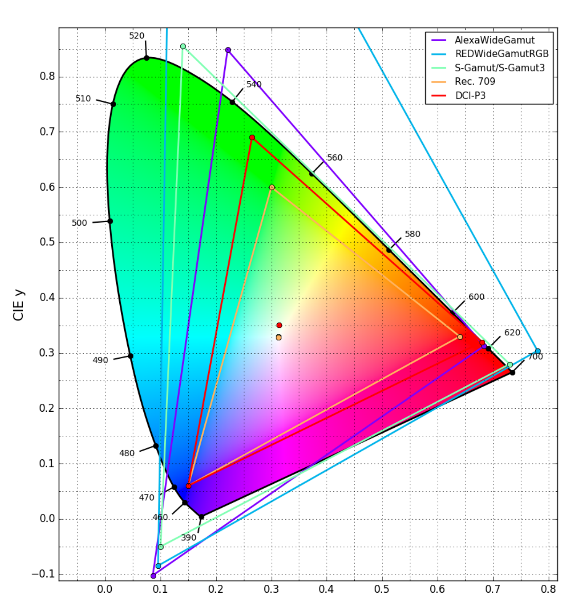

---
tags:
  - draft
  - review
---

# Figure Review — Chromaticity Diagrams

!!! success "Now live in the chapter — interactive"
    [Color Spaces → Display Color Spaces](../color.md#display-color-spaces) now embeds these as
    **live, interactive** [Color Plotter](https://ditools.videovillage.com/color_plotter) plots —
    drag to pan, scroll to zoom — with the static SVG kept as the print/offline/no-JS fallback.
    This page documents how that works, the accuracy check, and the tradeoffs. See
    [Interactive embeds](#interactive-embeds) below.

The two chromaticity figures are the strongest candidates for replacement with vector art:

- They are the **lowest-resolution figures in the document** (1075x1054 and 896x954 native), and
  cannot be improved by re-extraction because that is the resolution of the original artwork.
- They are pure line art with text — exactly what SVG is for. At any zoom the labels stay sharp,
  and the file is ~15 KB instead of ~650 KB.
- Their content is *derived*, not authored: a chromaticity diagram is fully determined by the
  primaries. Regenerating them from a current tool means the numbers can be verified rather than
  trusted.

## Interactive embeds

Each figure is now a live iframe running the full Color Plotter engine read-only, from
`ditools.videovillage.com/embed/color_plotter`. The plot travels entirely in the URL fragment
(`#p=<base64url(project+view)>`), so there is no server-side state and the URLs are reproducible
from `scripts/generate-chromaticity-embeds.mjs`.

It is built as **progressive enhancement**, so nothing is lost relative to a static figure:

- **No JS, print, or offline** → the static SVG shows, theme-matched, exactly as before.
- **JS + service reachable** → `docs/javascripts/color-plot-embed.js` upgrades the figure to the
  iframe, and only hides the static image once the iframe actually loads. If the embed is blocked
  or the service is down, the static figure stays.
- **Theme** → the fragment carries the plot theme, and the script swaps the light/dark fragment
  when you toggle the Material palette, so the plot follows the page.

Tradeoffs worth naming, since they are real:

- **External dependency.** The interactive layer loads from `ditools.videovillage.com`. That is a
  cross-origin iframe and third-party JS — acceptable for an interactive widget, and the static
  SVG remains the fallback, but the wiki is no longer fully self-contained for these two figures.
- **Not in the PDF or in print.** Interactivity can't exist there; both degrade to the static SVG.
- **The embed route is deployed but not yet merged.** It lives on the `claude/colorplot-embed*`
  branches of the tools repo. `/embed/color_plotter` is live in production today, but a rebuild of
  the tool from `master` without that branch would remove it — at which point the wiki silently
  falls back to the static SVG. Merging the branch makes the interactive layer durable.

## How the static fallback was generated

Rendered headlessly from Color Plotter's own scene/SVG modules, so the output is identical to
what the web tool exports:

```js
import { buildScene, fitPlotSize } from 'src/lib/colorplot/scene.js';
import { renderSVG }               from 'src/lib/colorplot/render_svg.js';

const scene = buildScene(project, view);
const svg   = renderSVG(scene, 1);
```

CIE 1931 xy, locus with wavelength ticks, legend on. Each figure is rendered twice — light and
dark — and the page serves whichever matches your theme, via Material's `#only-light` /
`#only-dark` suffixes. Try the theme toggle in the header.

**The spectral fill needed extra work.** Color Plotter's SVG backend deliberately omits the
per-pixel chromaticity wash — `render_svg.js` notes it is "the PNG path". So the pipeline is two
steps: the Node script emits the vector plot plus the fill as a raw tile computed with the tool's
own `xyToSRGBByte`/`diagramToXy`, and `scripts/embed_spectral_fill.py` encodes that tile as PNG
and embeds it as a data URI clipped to the spectral locus, beneath the grid and traces.

The result is a hybrid: **every line, label and legend is vector; only the wash is raster.** It is
the same gradient the Canvas renderer draws, so it matches what the web tool exports as PNG. At
~74 KB it is still roughly 9x smaller than the 660 KB originals.

---

## Figure 18 — Display color spaces

=== "Original (v1.0.1)"

    

    1075x1054 px · 663 KB · raster

=== "SVG replacement"

    
    

    vector geometry + embedded spectral fill · 73 KB · scales to any size ·
    follows the page theme

**Plots:** Rec. 709, DCI-P3, Rec. 2020 — matching the original exactly.

### Primaries used

| Space | Red | Green | Blue | White |
| --- | --- | --- | --- | --- |
| Rec. 709 | 0.640, 0.330 | 0.300, 0.600 | 0.150, 0.060 | D65 |
| DCI-P3 | 0.680, 0.320 | 0.265, 0.690 | 0.150, 0.060 | DCI |
| Rec. 2020 | 0.708, 0.292 | 0.170, 0.797 | 0.131, 0.046 | D65 |

The Rec. 2020 values match ITU-R BT.2100-2 Table 1 exactly. Rec. 709 matches BT.709, and DCI-P3
matches SMPTE RP 431-2. **The original figure's geometry agrees with these** — the two renderings
put the primaries in the same places.

---

## Figure 19 — Camera and delivery color spaces

=== "Original (v1.0.1)"

    

    896x954 px · 668 KB · raster

=== "SVG replacement"

    
    

    vector geometry + embedded spectral fill · 75 KB · scales to any size ·
    follows the page theme

**Plots:** ARRI Wide Gamut 3, REDWideGamutRGB, Sony S-Gamut3.Cine, Rec. 709, DCI-P3. (The v1.1
chapter plots S-Gamut3.Cine — the de facto Sony working space — rather than the original's
S-Gamut3.)

### Primaries used

| Space | Red | Green | Blue | White |
| --- | --- | --- | --- | --- |
| ARRI Wide Gamut 3 | 0.684, 0.313 | 0.221, 0.848 | 0.0861, −0.102 | D65 |
| REDWideGamutRGB | 0.780308, 0.304253 | 0.121595, 1.493994 | 0.095612, −0.084589 | D65 |
| Sony S-Gamut3.Cine | 0.766, 0.275 | 0.225, 0.800 | 0.089, −0.087 | D65 |
| Rec. 709 | 0.640, 0.330 | 0.300, 0.600 | 0.150, 0.060 | D65 |
| DCI-P3 | 0.680, 0.320 | 0.265, 0.690 | 0.150, 0.060 | DCI |

Note the **negative blue y coordinates** and REDWideGamutRGB's green at **y = 1.494**. These are
non-physical virtual primaries — exactly the point the
[Camera Color Spaces](../color.md#camera-color-spaces) section makes. Neither the original nor
the SVG shows RED's green primary, because it sits far above the plotted region; both crop it.
Worth deciding whether v1.1 should extend the viewport to include it, since a reader may wonder
where the cyan lines are going.

---

## Differences to decide on

These are genuine differences between the original and the replacement, not errors. Each is your
call.

### 1. The spectral fill is raster inside a vector file

The wash is a 495x560 PNG embedded as a data URI and clipped to the locus. That is a deliberate
compromise — SVG has no portable way to express a smooth 2D chromaticity gradient (mesh gradients
exist in the SVG 2 spec but no browser ships them), so the choices were a raster tile, tens of
thousands of tiny coloured polygons, or no wash at all.

Consequences worth knowing:

- Zoom in far enough and the **wash** softens, while the lines and text stay sharp. At normal
  reading sizes it is not visible.
- Print output is fine — the tile is ~500 px across a ~5 in figure, roughly 100 dpi for a smooth
  gradient with no detail in it.
- If you would rather have a fully vector file, say so and I will drop the fill; the geometry
  version is 14 KB.

### 2. Naming

The original Figure 19 legend reads **"AlexaWideGamut"**. The SVG uses **"ARRI Wide Gamut 3"**,
which is the current name and distinguishes it from AWG4 (introduced with the ALEXA 35). Since
[Notes for v1.1](../v1.1-notes.md#cameras-and-raw-formats) already recommends normalising to
ARRI's current styling, the rename is consistent — but it is a change from the original.

### 3. The chapter table lists a space the figure never plotted

*Resolved.* v1.0.1 listed **RED DRAGONcolor2**, which the figure never plotted and which RED has
retired in favour of REDWideGamutRGB. It has been dropped from the
[Camera Color Spaces](../color.md#camera-color-spaces) table, and the Sony entry updated from
S-Gamut3 to **S-Gamut3.Cine** (the de facto working space). Table and figure now agree.

### 4. Colour assignments

Trace colours were chosen to echo the originals (Rec. 709 blue/violet, DCI-P3 red, Rec. 2020 red
in Fig. 18; ARRI violet, RED cyan, Sony green in Fig. 19) but they are not sampled matches. Easy
to adjust — say the word and I will match them precisely, or move to a palette that is
colour-blind safe, which the current red/green pairing is not.

### 5. Dark mode

The dark variants use the tool's dark palette with the fill at 92% opacity — matching what the
Canvas renderer does over a dark background, so the wash does not overpower the traces. If the
handbook will only ever be read in one theme, half of these files are unnecessary.

### 6. Viewport

The SVGs use a slightly wider view than the originals so no trace touches the frame edge except
RED's green. If you would rather they match the original crop exactly, that is a one-line change.

---

## Recommendation

Live in the chapter now: **interactive plot, static SVG fallback.** The reader gets a diagram
they can pan and zoom, with the spectral wash present in both; anyone printing, offline, or
without JS gets the theme-matched SVG. The accuracy is verifiable, both layers regenerate from
committed scripts whenever a primary set changes — which matters given that ARRI, RED, and Sony
have all revised their color science since 2017.

The one thing that needs a decision from you: **merge the `claude/colorplot-embed*` branch** in
the tools repo so the `/embed/color_plotter` route is durable. Until then the interactive layer
depends on that branch staying deployed; if it is ever dropped, these two figures quietly revert
to the static SVG — no breakage, just no interactivity.
