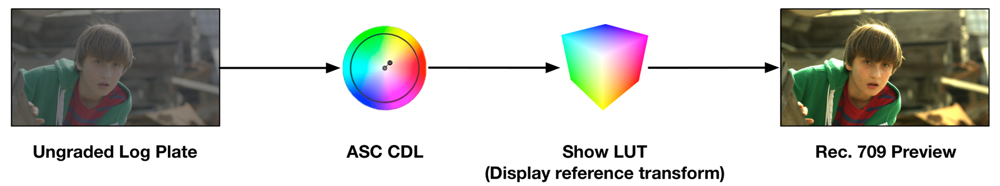

# Generalized Production Workflow

## Pre-Production / Visualization

A key factor in the success of visual effects films is the previsualization process (previz). This is
essentially the 21st century equivalent of storyboarding. Although many directors and
producers still employ traditional storyboarding, previz complements storyboarding through
specific blocking, staging, and theoretical execution of complex shots, scenes, and sequences
prior to production.

Previz animatics are helpful in building an early edit of a sequence and determining the pacing
of a scene, identifying redundant shots as well as realizing the need to add new shots. Shooting
parameters such as camera angle, lens type, and camera trajectory are useful in planning out
the shoot. This process helps producers determine what equipment will be necessary to
produce those shots, often down to the make and model of the equipment (a camera crane, for
example). This provides for a streamlined production process and reduces technical
improvisation on the day, reducing potential error while providing the filmmakers with a
rehearsed, choreographed result. Ultimately, previsualization is a cost-saving measure.

There are several companies that provide previsualization services to filmmakers. They are
comprised of staff and freelance CGI artists who scale up depending on the needs of the
project. They are capable of working at their studio or on-site with the production staff in the
pre-production offices.

Not all independent productions have the need for CGI visual effects, but for those that do,
previsualization is often viewed as an unaffordable luxury. Detailed animatics may not be
necessary for all scenes, but it is beneficial to at least previz complex shots. Engaging a single
freelance previz artist to help plan some of the more complex shots or scenes could easily save
a lot of time and money during production.

## Production / Acquisition

### Camera and Workflow

There are many digital cinema cameras on the market today. A skilled cinematographer can
make great images using any of them. The key factor that makes all of these cameras "digital
cinema" cameras, rather than "video" cameras, is that they are able to record high dynamic
range, scene-referred images, rather than display-referred images. This is paramount as it
optimizes the available dynamic range and flexibility in color grading and visual effects during
post-production. Scene-referred recording either manifests itself as a recorded logarithmic (log)
raster image, a scene-linear raster image, or a Camera RAW file. These topics are explored
further in [An Overview of Digital Intermediates](digital-intermediates.md).

### Visual Effects Production

Some of the most common errors in visual effects originate during production. Visual effects,
like many aspects of filmmaking, is "garbage in, garbage out". If the production plates are
poorly shot, the visual effects work is going to suffer from it, or the cost and time required to
repair the shots in post will increase.

The single best way filmmakers can ensure positive visual effects results is by involving an
on-set visual effects supervisor. In an ideal world, this would be the same VFX supervisor who is
overseeing the project's visual effects through completion. But if they are unavailable, a
senior-level artist or another supervisor they trust would be an ideal replacement.

The VFX supervisor's role on set is consulting with the director, cinematographer, production
designer, practical effects teams, and various other departments about the creative and
technical execution of visual effects shots. They are relied upon to consult on potential issues
other departments face and whether or not the visual effects department can provide a
solution. They can identify potential issues and provide solutions that could quickly and cheaply
save hours of time either in production or post. Issues that are obvious to a supervisor are not
necessarily obvious to other crew, as they don't usually have intimate experience dealing with
those issues in post. Something as simple as how evenly lit a green screen is, or the angle of a
light reflecting on a surface, can make a huge difference in the ultimate complexity of a visual
effects shot.

A good VFX supervisor knows how to strategize and strike a balance between what should be
produced practically on set and what tasks are better suited for visual effects. Working as a
creative collaborator with different departments is a key strength of a good VFX supervisor.

Detailed camera notes, generally produced by the camera assistants, aid in reproducing
accurate scenes in CGI. Either during camera prep or during the shoot, the camera team will
shoot lens distortion charts for later use by the visual effects department in compositing and 3D
camera tracking.

### Common Visual Effects Production Mistakes

The biggest mistake a production can make related to visual effects is to not hire a VFX
supervisor to be present during production. Too often, lower budget productions make
assumptions about what would or would not be easily handled in VFX, and this often leads to
some friction later on when the complexity and reality of the issue becomes apparent. Having
an experienced on-set supervisor is imperative not only in making sure potential challenges are
documented and properly accounted for, but also in avoiding them through on-set practices if
possible.

!!! example "Anecdotally"
    A recent production needed many tracking markers for camera tracking. Knowing they had
    limited staff and budget to paint those out later, the VFX supervisor collaborated with the
    production designers to incorporate patterns into the set design that were detailed enough
    to use as tracking reference and complemented the sci-fi design aesthetic — eliminating the
    need to remove them in post.

## Digital Dailies

In a typical studio production, camera original media is ingested on set by a Digital Imaging
Technician (DIT) or a Digital Asset Manager (DAM) and archived to hard drives, LTO tape, or
both. A copy of those assets is delivered to the dailies team, either on-set, near-set, or at the
lab or post-production facility. There, a dailies colorist or dailies technician will apply looks
created on-set by the DIT or the cinematographer to relevant shots in scene context and make
any necessary balancing or aesthetic color corrections. They will sync the production audio
tracks to picture and then process the camera original media into an offline proxy format
suitable for editorial, including relevant metadata necessary to reference the original media.
These offline proxies are rendered with the dailies color grade and the Show LUT baked in, and
are sized and formatted in accordance with the framing chart. Dailies are often processed
unmatted in order to provide editorial with creative reframing flexibility.

In the independent production world, this level of complexity is rarely observed. Typically, there
is a single DIT or a DAM, but rarely both. They may also be responsible for syncing and
processing dailies, but that task is often delegated to the production editorial team.

Processed dailies are delivered to production editorial as DNxHD 36 QuickTimes or MXFs, or
Apple ProRes QuickTimes. Circled takes — occasionally all takes — are transcoded to H.264s with
audio and uploaded to a secure server and provided to the filmmakers for creative review. PIX
and DAX are the predominant studio-approved review systems, but there are many more out
there that can benefit productions of all scales. Low-cost review tools such as Frame.io, Vimeo,
and Dropbox are useful alternatives for budget-conscious independent productions.
Medium-budget projects that require more granular control over user permissions may consider
products like Wiredrive.

!!! warning "Out of date"
    The specific review platforms named here have changed substantially since 2017. See
    [Notes for v1.1](v1.1-notes.md#review-and-delivery-platforms).

Efficient tools become even more important as the decrease in staffing brings the consolidation
of responsibilities onto a select few individuals. Blackmagic Design's DaVinci Resolve has
become a prominent resource for many DITs, DAMs, and editors, as it supports all major Camera
RAW formats, syncing audio, color grading, applying LUTs, rendering metadata burn-in, and
transcoding to various offline and online codecs.

## Creative Editorial

On studio films the picture editor and their assistants (who comprise the production editorial
team) are on-set or near-set assembling cuts as the dailies arrive each day. Having
nearly-immediate feedback is critical not only for the director, but also for the VFX supervisor.
The VFX supervisor and VFX producer will be intimately involved with the timing and execution
of complex sequences. As soon as the best takes are selected, they will have those plates
processed and delivered to the visual effects vendor, whether that is a studio or a single artist.
It is common for early visual effects work to begin while a film is still in production.

As the production progresses and visual effects shots are added spontaneously or reduced
through alternative practices, the VFX supervisor and their team maintain an up-to-date
assessment of the visual effects needs of the film through continual dialogue with the editorial
team. On an independent feature with fewer complex sequences or shots, having early edits
and reviews of dailies provides additional opportunities to identify any potential issues that
could still be addressed during principal production.

During creative editorial it is common to use temporary graphics, rough composites (called slap
comps), and previz animatics to convey story beats that will be produced and refined at a later
date. This is important in estimating timing and determining whether key story elements are
adequately conveyed. On a studio film, this is often the job of the visual effects editor, who
works alongside the picture editor and the assistants. On an independent production without
an expansive editorial team, those duties fall to the picture editor or their assistant(s).

The modern picture editor is a jack of all trades. Not only are they an expert in performance
timing and an experienced storyteller, but they are also creative problem solvers looking for
effective solutions to issues that arise during production or editorial post-production.
Sometimes a line is cut, but there is insufficient coverage to cut away to, so they may creatively
blend two halves of a shot together to remove a line of dialogue. This is accomplished with
FluidMorph in Avid or similar optical flow morphing tools found in other software. Similarly,
the desired dialogue of two actors in a two-shot may require the splitting and compositing of
two separate takes over each other. Split-screen composites — using Avid's AniMatte or similar
garbage mask tools in other software — for performance timing are incredibly common and are
a great example of seamless visual effects artistry.

Naturally the standard practice would be to involve the VFX supervisor. But on projects where
the editor is the de facto VFX supervisor, having experience in visual effects will serve them well
— not that they are expected to produce the final result, but so they know what can be
reasonably produced in visual effects.

## Visual Effects Plate Pulls

Once a sequence edit is locked, or very close to locked, the editorial team will produce a pull
list of the visual effects shot elements so that they can be prepared and delivered to the
vendors or artists who will be working on them. This list is often as simple as an EDL or XML of
just the necessary visual effects shots, excluding any non-VFX footage. This list also correlates
the original camera shot names with their intended VFX shot names.

It is important to pull these plates in a way that is efficient for the visual effects artists. It is not
advisable to give the artists a hard drive containing the Camera RAW footage and a copy of the
edit and expect them to accurately pull the shots they need. It is best to have pulls originate
from a single third party or from production directly.

Pulls are made with handles, often just a couple of frames on the head and tail of the edit. This
provides the visual effects artists with the frames they need plus a few extra in case the edit
needs to be creatively rolled once the shots are complete. It is up to the production to come to
an agreement with the VFX artists or vendors about how many handle frames they will be
working with and delivering back to editorial.

Visual effects plate pulls are commonly produced as image sequences (DPX or EXR), where each
frame is an individual file rather than a single movie container. This is a common practice in
visual effects and is highly recommended.

Visual effects plates are not provided to artists in the Camera RAW format, but instead
debayered with show-specific settings for resolution, color space, and transfer function. These
plate pulls are performed with a scene-referred transfer function to maintain all of the
camera's native dynamic range and gamut. It is important that all plate pulls are produced by
the same technician or company in order to maintain consistency. Otherwise individual visual
effects artists or vendors are expected to coordinate clip pull methods together, and more often
than not, unintentional deviations will occur.

Camera RAW is an inefficient working format for visual effects, as it must be debayered on the
fly every time a frame is viewed or referenced. This is computationally expensive and
redundant compared to pre-debayering to a rasterized working format. Moreover, standardizing
on a single plate format makes working with footage from multiple camera types or sources much
easier for the visual effects artists and maximizes software compatibility. While many
compositing applications provide support for Camera RAW formats, debayering quality and
algorithms can differ system to system, and many support applications used in asset
management, 2D/3D tracking, and paint do not support them.

In studio productions, plate pulls are often handled by the digital intermediate vendor, as they
have intimate knowledge and experience working with Camera RAW formats and
color-managed workflows. At the independent production level, involving the colorist, or someone
else with digital intermediate experience, is advisable. This can be someone like a DIT or a very
technically savvy editor. When in doubt, consult with a post-production vendor or the final
colorist to make sure you are following the correct procedures.

There are services and products designed for managing production assets on large projects and
producing visual effects clip pulls. Codex Backbone and Technicolor PULSE were two such products
used to decrease the time for visual effects plate pulls and turnovers to vendors, via
hardware/software and cloud-based solutions that minimize the time and staffing required. Both
have since left the market — Codex Backbone is no longer in Codex's product lineup, and Technicolor
PULSE is defunct — though the same need is now served by media-management and production-tracking
platforms.

## Visual Effects Plate Pre-Grading (Optional)

In studio productions it is common to perform a pre-grading pass on visual effects plates prior
to their delivery to the visual effects vendors. This is usually performed by the final film colorist,
or an associate of theirs, in collaboration with the director, cinematographer, VFX supervisor,
and VFX producer. This process is done to give the plates a grade close to the final intended
look of the film, as best as it can be approximated at this early stage in post-production.
Naturally, this occurs long before the final color grading takes place, but is done to provide an
approximation of how the shot will eventually be graded.

This is critical when the eventual grade will have a significant impact on CGI rendering and
lighting. For example, a day-for-night look would likely influence the creative lighting decisions
the CGI artists would make.

These grades are often very simple and restricted to basic slope, offset, power, and saturation
adjustments compliant with the ASC Color Decision List[^3] (mathematically translatable to lift,
gamma, gain, and saturation) and are performed on scene-referred material under the
display-referred Show LUT. CDL is intentionally restrictive so that the grading decisions are limited to a
set of ten values that can be easily communicated through various metadata database formats
(EDL, ALE, CC, CCC). The intention here is not to render any color changes into the image,
presenting the visual effects artists with an unaltered plate, while providing them with the
means to accurately preview the pre-grade during their compositing. The ASC CDL specification
is a simple, but standardized, color correction process which can be applied consistently and
accurately across different grading systems and visual effects applications.

[^3]: <https://en.wikipedia.org/wiki/ASC_CDL>

Alternatively, more complex grades can be baked in, but it is important to provide the ungraded
plate as well, as grades can often reduce scene detail needed for tracking or degrade
green/blue screen separations.

The Show LUT, shot-specific CDL metadata, and ungraded plates are delivered to the visual
effects artists or vendors. If they apply the CDL values and the Show LUT, they will preview the
exact same grade that you performed during the pre-grade. By accurately previewing the
eventual grade of a shot, visual effects artists can composite their effects to look best and most
accurate under that anticipated grade. This is particularly important when dealing with product
shots or with characters that have a well-established color palette.

<figure markdown>
  { loading=lazy }
  <figcaption>Figure 1 — CDL grading operations are applied prior to the viewing transform.
  Ungraded log plate → ASC CDL → Show LUT (display reference transform) → Rec.709 preview.</figcaption>
</figure>

The grade and Show LUT are baked in to any reference QuickTimes delivered to editorial in
order to match the original dailies grade, but ultimately not included in the final VFX render, as
the colorist will apply those looks in the DI session.

## Visual Effects Production

Here is where all the magic happens. During this process the visual effects artists and vendors bring
the shots to life. This is an iterative process that relies on continual support and collaborative
feedback from the filmmakers. Depending on the complexity of a shot there may be more than
one artist assigned to it, and in some cases multiple VFX companies. There are many different
departments within visual effects that artists belong to. Many are compositors, specializing in
integrating elements and solving problems using 2D or 2.5D tools. Others are CGI generalists or
specialists, creating something from nothing in 3D and working with compositors and lighters to
integrate it into a live-action scene in a photorealistic way.

The more shots you have and the more artists working on them, the greater the need for
efficient shot management. This falls under the responsibility of the VFX producer and the VFX
coordinators, often grouped under VFX production management. On a small independent
production this may, once again, fall back on the editor. Managing visual effects work in a
flexible, organized way is critical to your success.

Different VFX producers and coordinators have different management styles and tools that they
use for tracking assets, artists, client feedback, and progress. Sometimes this is as simple as
shared spreadsheets either from Excel or Google Sheets. Other times it requires more
complicated software specific to the visual effects industry like ftrack or Shotgun. These
production management systems are purposely designed to maintain the flow of visual effects
production and help the producers stay on track. Nothing is more worrisome than not having a
reliable estimate of when you can complete your work. VFX production management is
explored in greater detail in [Visual Effects Production Management](vfx-production-management.md).

One of the core tenets of visual effects production is that regions of an image without visual
effects (i.e. elements of the camera original plate that are retained in the final comp) should
undergo zero net change. Unless specifically mandated by the visual effects workflow, there
should be zero net change in color space or color encoding. It is very common for material to
be transformed into a more convenient working space for compositing (e.g. camera log to
scene-linear); however, it must return to its original encoding before delivery and without
clamping, quantization, or other artifacts.

A best practice to avoid issues is to double-check the final render against the original plate. If
there is a measurable color shift or degradation that is not part of the intended effect, there is a
pipeline issue that needs to be addressed prior to delivery to the client.

It is common for the VFX production team to produce a confidence package consisting of a few
test images in the project's working format and provide it to the various vendors and artists
they are hiring. The vendors and artists will pass the test images through their entire
pipeline and return them back to the VFX production team for review. This allows production
and the vendors to identify issues in the VFX pipeline before expensive work begins on actual
shots.

## Visual Effects Editorial

During the visual effects process the filmmakers will receive preview renders from artists and
vendors. These renders are usually lower quality QuickTime proxies and have the temp color
correction (from the pre-grade) and the Show LUT baked in so that the picture editors can cut it
into their timelines and review in the context of the scene or sequence dailies. These are
regularly delivered as Avid DNxHD 36 or Apple ProRes 422 LT. Here the goal is to review for
content and design, not technical quality control. These offline references are named and
contain timecode to match against the full quality, ungraded DPX or EXR renders that will
ultimately be delivered to the DI.

It is important that the imported QuickTimes retain their timecode metadata throughout offline
editorial. Without timecode, the editorial conform turnover to the DI will not accurately
reference the full quality renders that VFX has delivered to the DI. It is standard practice to
conduct workflow meetings and tests early on between the VFX vendors, creative editorial, and
the DI to ensure that conform and color management issues are identified and resolved early.

### Visual Effects Reviews

Later in the visual effects process, as shots are nearing completion, the filmmakers (director,
producers, VFX supervisor, VFX producer, and their respective teams) review full quality
renders of the shots in a color accurate context, often in a digital cinema theater at a
post-production facility. At this stage it is important to review in a calibrated environment accurate
to the intended exhibition (theater for theatrical projects, broadcast monitor for broadcast or
streaming projects). Here they can identify technical issues that are more apparent on the big
screen and can experiment with color grading decisions with the colorist or an associate
colorist. Here they will review in the context of the Show LUT and VFX shot CDL values.

## Digital Intermediate

As visual effects near completion, they are delivered both to the filmmakers and to the digital
intermediate vendor/facility either simultaneously or when requested by the production
editorial team. Production editorial (often the VFX editor) will cut in the latest and greatest
visual effects shots and the assistants will turn over edit lists (EDLs, XMLs, or AAFs) to the DI,
where the conform editor(s) will conform the DPX or EXR renders and update the colorist's
timeline. It is necessary for the file naming and frame numbering of visual effects shots to
consistently match the offline reference QuickTimes in order to facilitate a fast and accurate
conform.

In the grading theater, filmmakers will view the shots in the full, highest quality with the
colorist and make color grading adjustments. This again is an iterative process. It is prudent to
provide temp visual effects shots or works in progress (WIPs) to the colorist so that they can do
some of the preliminary grading work, rather than waiting idly until a shot is completely final.
As the deadline approaches, it becomes more and more common for the colorist to tackle
issues that are too time consuming to send back to visual effects, such as lighting continuity and
color matching.

Visual effects typically fall into three categories of completion: temp (WIP), final, or
could-be-better (CBB). CBBs are any shots that are deemed passable as is, but have improvements to be
made if time permits. Those shots are only a priority once all of the temp shots are finalized. It
is not uncommon for CBBs to make it into early deliveries of a film, such as international
theatrical releases which often ship earlier than the domestic versions. Ultimately most CBBs
are improved prior to the home video mastering phase, as home video is ultimately where the
film will be most scrutinized by audiences in years to come.

### Visual Effects Version Checking

Before finalizing the DI on a reel or episode, the editorial assistants and VFX production
coordinators will work with the conform editor to verify that all the correct versions of visual
effects are in the film or show. This usually involves checking version numbers, but can also
require visual inspection of shots to verify that the intended revisions are present. It is not
uncommon for a production to roll back to an earlier version of a visual effects shot if they like
it more than subsequent revisions, so it is never safe to assume the latest available version is
the correct one.

In addition to manually verifying the shots, an EDL of the VFX shots, exported from the DI to
production editorial, can aid in performing this critical check.

## Theatrical Distribution Masters

Feature films destined for digital cinema release are mastered and delivered to theaters in
Digital Cinema Packages (DCPs). DCPs are mastered from a DCI-P3 referred graded master. They
are often assembled and mastered on separate systems apart from the DI, and oftentimes by
facilities separate from the colorist's. The various picture deliverables required to produce a
DCP are:

### DSM (Digital Source Master)

An uncompressed, unencrypted, graded render of the film. Typically DCI-P3 (RGB) color space.
Sized per digital cinema specifications. Often 10-bit or 16-bit DPX.

!!! note
    This element is often skipped, as the colorist or DI facility will produce a DCDM directly
    from the color grading system, rather than from a DSM.

### DCDM (Digital Cinema Distribution Master)

An uncompressed, unencrypted, graded DCI-P3 render of the film in DCI-X'Y'Z' color space. Sized
the same as the DSM. 16-bit TIFF. The DCDM is only useful for producing a DCP and is typically not
utilized in any other deliverables.

Because those 16-bit TIFF sequences are enormous — on the order of 10 TB for a feature —
exchanging a DCDM between facilities is slow and costly. [**SMPTE ST 428-24
(2024)**](https://pub.smpte.org/pub/st428-24/) defines a *packed image* DCDM (**pDCDM**) to
address this: it maps the DCDM into a **losslessly (reversibly) coded JPEG 2000** file sequence and
packs the image's 12-bit code values directly instead of padding them into a 16-bit container. The
baseband image reconstructs exactly — this is *not* a lossy proxy — while file size drops by roughly
half from the reversible coding, plus a further ~25% from the 12-bit packing. It may optionally use
the high-throughput JPEG 2000 (HTJ2K) block coder for much faster encode and decode. Think of it as
a transport-efficient equivalent of the TIFF DCDM, not a substitute for the DCP's lossy essence.

### DCP (Digital Cinema Package)

The DCP is a compressed, encrypted package muxed from the DCDM picture render, audio
printmasters, subpictures, and timed text (subtitles). Encrypted DCPs can be played back on
servers that have had valid KDMs (Key Delivery Messages) generated for them by the DCP
creator.

Features being commercially exhibited in mainstream theaters are encrypted and the various
theaters are given digital keys that allow them to play the film for a certain range of dates,
often limiting the hours of the day that the film can be played. For festivals and private
screenings of independent films, it is most common to produce unencrypted DCPs to avoid
potential security issues in the event that a venue changes last minute or there is not enough
time to test and validate the keys prior to the screening.

## Video Distribution Masters

For projects destined for home video or over-the-top (Netflix, Amazon, iTunes, etc.) release,
there are some typical delivery formats:

### Uncompressed Video Master

A complete, color graded master with titles, graphics, and visual effects, with accompanying
textless elements. Textless elements are often delivered with handles (the entire shot before and
after the textless element). Video masters are rendered in the mastering display's color space
(i.e. Rec.709 or Rec.2020) and at agreed-upon delivery resolutions — typically HD (1920x1080)
and UHD (3840x2160).

### IMF (Interoperable Master Format)

Same as the video master, often without textless elements. Compressed and mastered per the
IMF specifications. This master includes audio married from the audio printmasters and may
contain subtitle metadata.

### ProRes 422 HQ

For independent distribution this is the dominant deliverable. Not just iTunes but the great
majority of TVOD platforms and independent distributors want a compressed **ProRes 422 HQ**
variant of the video master (occasionally ProRes 4444 when a distributor simply wants a
higher-quality master) —
and very few independent distributors ask for an IMF package at all. [IMF](imf.md) is a
studio-and-streamer interchange format; the label releasing an independent feature almost always
wants ProRes and handles the platform-specific encoding downstream. See
[Distribution Deliverables for Independent Film](distribution-deliverables.md) for what real indie
delivery schedules actually require.

## Archival

Once a project is completed and delivered, it is still necessary to archive and preserve working
files and various additional renders to provide an easy path towards future remastering.

Different studios have different requirements and specifications for archival elements.
However, most require some variation of the following in addition to the video distribution
master:

### Ungraded Archival Master

A complete, uncompressed, ungraded render of the conformed project, containing completed
visual effects, opticals, titles, and other picture elements. Textless elements should be included
as well. Rendered at the highest resolution applicable — often the project's most common
camera original resolution. In camera native log or scene-linear. Typically rendered as 16-bit
DPX (log) or 16-bit float EXR (scene-linear).

The Ungraded Archival Master serves as the digital equivalent of a negative assembly. It differs
from other deliverables primarily in that it is fully uncompressed and not color corrected.

### Graded Archival Master

Typically the same format and resolution as the Ungraded Archival Master, differing in that it
contains color graded images. However, this master is required to be in the DI's original working
color space (i.e. camera native color space). In order to produce this deliverable, a project's
color pipeline must be completely scene-referred, relying on a forward display-referred
transform at the end of the pipeline. Any color grading operations must happen before the
display transformation LUT.

### Show Look Up Tables (LUTs)

In order to reproduce a graded video master, the project's display transformation LUT(s) must
be provided.

### Reference EDLs

Flattened EDLs of the finalized DI timeline, matching the master and archival renders, are
generated so that they may be easily split (or notched) at edit points in a later session, possibly
on a different platform than the initial DI.

### Storage: LTO, cloud, and the trouble with hard drives

An archive is only as good as the medium it lives on and the number of copies you keep. There are
three realistic media for holding finished masters and project files: **LTO tape**, **cloud cold
storage**, and **hard drives**. They differ enormously in cost *structure* — and the sticker price is
usually the least important number.

The calculator below estimates the cost of **archiving a given amount of data once, holding it, then
fully restoring it** — drag the sliders for your data size and retention period. It is a planning aid,
not a quote: cloud rates and egress tiers change often, and the LTO figures separate the tape stock
(hard costs) from a per-TB service rate.[^ltocost]

  

    

      <label>Data archived: 100 TB</label>
      <input type="range" id="ac-tb" min="1" max="1000" step="1" value="100">
    

    

      <label>Retention: 3 years</label>
      <input type="range" id="ac-yr" min="1" max="15" step="1" value="3">
    

  

  

    <table>
      <thead><tr><th>Option</th><th>Hard costs</th><th>Ingest</th><th>Storage</th><th>Restore</th><th>Total</th></tr></thead>
      <tbody id="ac-body"></tbody>
    </table>
  

  
Estimates at mid-2026 rates for a single full restore to the open internet; cloud storage is each provider's cold/archive tier. Egress tiers and provider rates vary — verify before budgeting. Backblaze and Wasabi assume the restore falls within their included free-egress ratio. LTO assumes you keep the tapes (no vault fee); see the footnote for the service-rate assumptions.

[^ltocost]: The LTO **hard cost** is the tape stock alone: LTO-9 holds 18 TB native per cartridge, so
    the calculator charges `ceil(TB ÷ 18)` cartridges at ~$120 each (~$6.70/TB). The **ingest** and
    **restore** columns are a managed-service rate — the facility's decks, library/robot hardware,
    cataloguing, and the labor of writing, verifying, and later reading the tapes — modeled here at
    **~$50/TB each way**, in line with 2025–26 service rate cards. Most services set a **job minimum**
    (~20 TB) below which per-TB pricing stops making sense; smaller jobs are better billed hourly
    (~$150/hr), and additional tape copies typically run ~50% of the first. (Doing it in-house instead
    trades the per-TB service fee for buying your own LTO-9 deck, ~$4,000–7,000, plus your time.) The
    scenario assumes **you keep the tapes**, so there is no monthly vault fee — a handful of cartridges
    is physically small, and even a safety-deposit box for them is negligible. Cloud figures assume the
    cold/archive tier of each provider; egress assumes a single full download to the open internet and
    is where the "cheap to store" tiers get expensive. Prices as of mid-2026 — verify current rates
    before budgeting.

**Read the total, not the headline rate.** Cold-cloud tiers advertise roughly $1/TB/month to *store*
but bill heavily to get the data back — retrieval plus internet egress is the real cost, and a full
restore can dwarf three years of storage. The flat-rate clouds (Backblaze, Wasabi) invert this: egress
is free or included, but storage is 5–7× more, so a multi-year hold costs the most overall. Cold cloud
like Glacier Deep Archive is only cheapest for a short hold — because it bills every month and stings
on egress, **it climbs past LTO after roughly two years** of retention.

**LTO's cost is front- and back-loaded service; the tapes cost almost nothing to keep.** You pay a
service to write the tapes and to read them back, but the stock itself is only ~$7/TB and, once
written, the cartridges sit on a shelf with no monthly bill and no power draw — so the LTO total barely
moves whether you hold for three years or ten (drag the years slider and watch it stay put), while
every monthly-billed cloud keeps climbing. Over the long retention a film archive actually needs, that
structural difference is the whole case for tape: at the calculator's three-year default LTO is already
the cheapest option, and it carries none of the clouds' ongoing billing, vendor, or egress risk.

**Hard drives are the wrong medium for a master archive.** They are fine as a working or nearline
copy, but dangerous as your *only* long-term one:

- They are not designed to sit unpowered for years. Bearings can seize ("stiction"), lubricants
  migrate, and the magnetic charge fades; the safe retention of an unpowered consumer drive is a few
  years at best, not decades.
- They are mechanical, shock-sensitive single points of failure — one drop kills the copy.
- Bit rot is silent without checksums.

If you must use HDDs, keep **at least two copies**, power them up and verify them periodically, and
never let a lone drive be the archive.

**Your financing may require proper archival, not merely recommend it.** On a bonded or
investor-backed film, archival is a contractual matter, not just a technical one. A **completion
guarantor** (the completion-bond company) guarantees the film will be finished and *delivered to the
distributor's specification* — and the preservation and archival elements are part of that delivery, so
the guarantor, the financiers, and the distributor all have a stake in the masters surviving intact. In
practice that means archival masters on **LTO with verified checksums, redundant copies, and offsite or
vaulted storage**; a lone hard drive satisfies neither a guarantor, a distributor's delivery QC, nor a
media insurer. Productions also carry **negative / digital-media insurance** covering loss or damage to
the recorded footage and masters, and both the bond and that coverage assume the material is stored to
a professional standard — a data loss traceable to a single unpowered drive is exactly the avoidable
negligence that complicates a claim. Even setting cost aside, the money above the production usually
dictates LTO-grade archival.

**LTO is the film-industry archival standard — with a format treadmill.** LTO media is rated for
~15–30 years in controlled storage, is offline and air-gapped (ransomware cannot reach a tape on a
shelf), self-describing through **LTFS**, and available as write-once **WORM**. The catch: LTO drives
read only about one to two generations back (an LTO-9 drive reads LTO-8 and 9 only), and the roadmap
keeps advancing, so plan to **migrate to a newer generation roughly every 7–10 years**, before the
drive generation you own goes unsupported.

**Cloud's strength is offsite; its risks are ongoing.** Cold cloud (Glacier Deep Archive is the
cost-competitive one) gives geographic redundancy and very high durability with no hardware to own or
migrate — the provider handles that. But it is a permanent operating cost, exposed to price hikes
(Backblaze and Wasabi both raised rates in 2026) and to vendor and account risk (a lapsed card or a
closed account can mean lost data), and a full 100 TB restore is a large, slow, sometimes costly
download. Model the egress cost *and* the transfer time before you depend on it.

!!! tip "The smart default: 3-2-1, not one of anything"
    Keep **three copies, on two different media, with one offsite.** For an independent film that
    usually means **two LTO copies — or one LTO plus a cold-cloud copy for the offsite** — each
    verified with checksums (an **MHL**, media hash list), holding the graded and ungraded archival
    masters, textless elements, the audio stems and M&E, and the conform project. Whatever you choose,
    do not let a single hard drive be the only thing standing between you and a future remaster.
