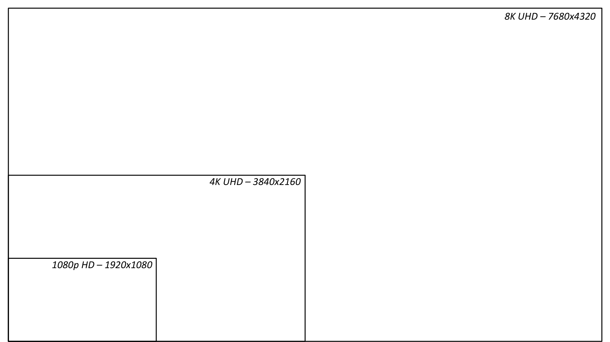
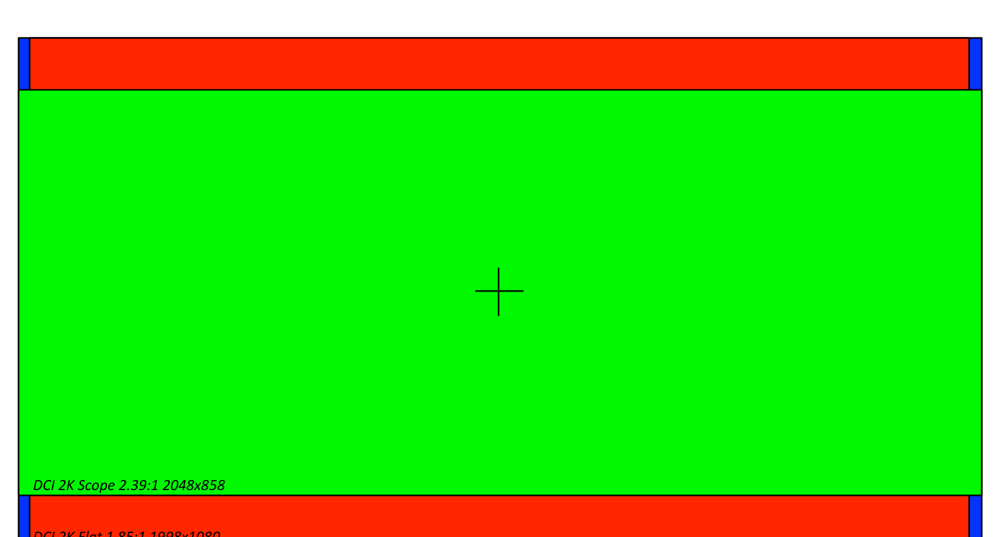
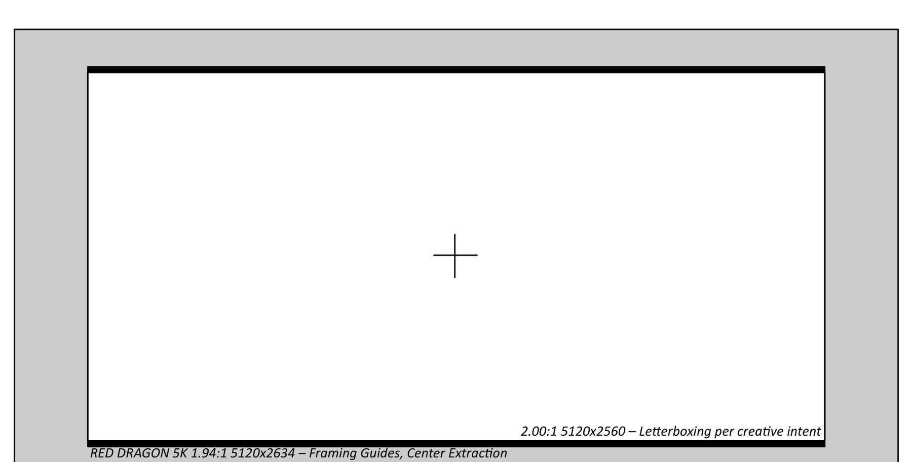
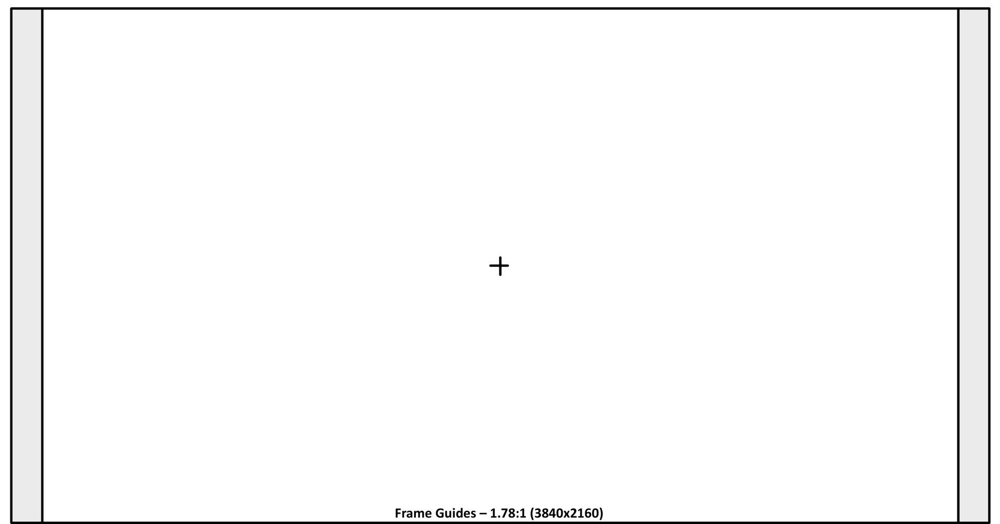
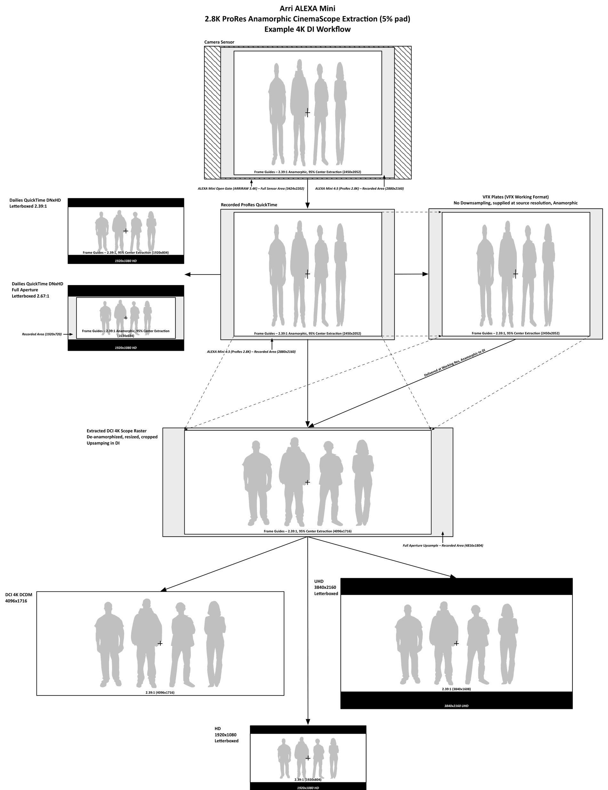
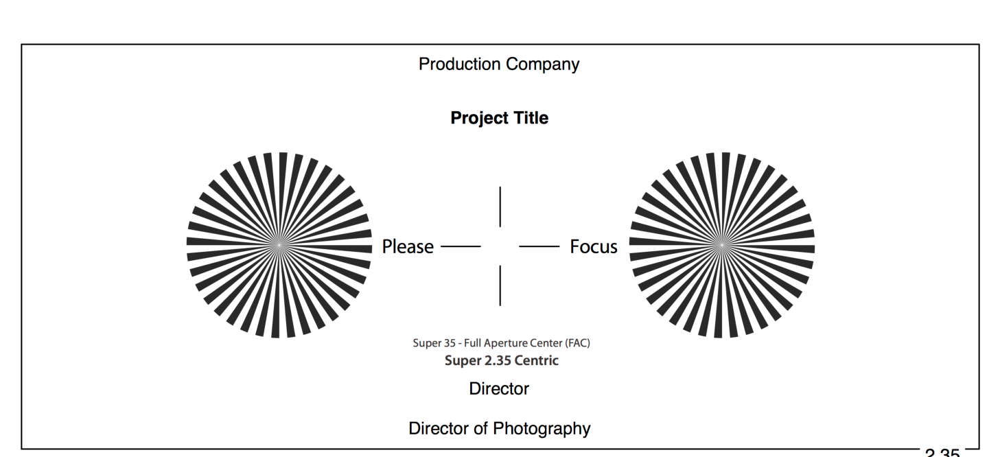
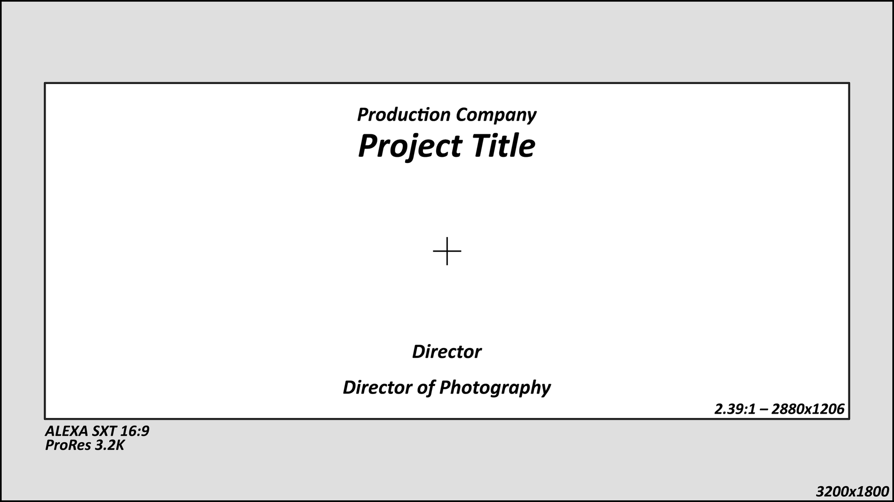
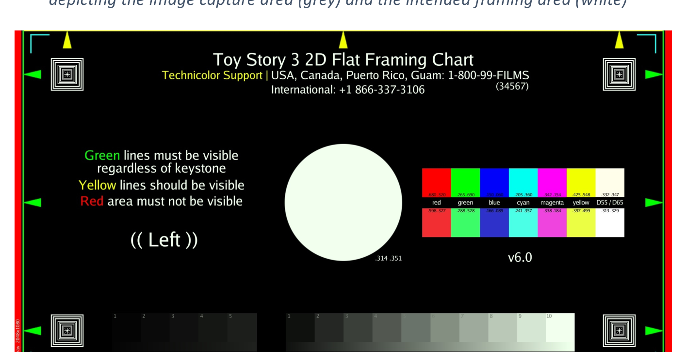

# Common Working and Delivery Resolutions

On a given project, there may be multiple camera acquisition formats, each with different
resolutions and frame guides for achieving a desired aspect ratio. In distribution, there are
often multiple varying container formats.

## Camera Original Media

Various cameras by various camera manufacturers record images in a multitude of resolutions,
some native sensor resolutions and others downscaled. There is no standard resolution or
aspect ratio. Several cameras natively record at 4K DCI Full (4096x2160), but many others
record at non-standard resolutions or aspect ratios for a variety of applications. Many cameras
will have multiple different recording formats derived from the native sensor format.

Detailed sensor specifications are available from camera manufacturer websites.

## Delivery Formats for Video

<figure markdown>
  { loading=lazy }
  <figcaption>Figure 10 — Comparison of HD and UHD resolutions: 1080p HD (1920x1080),
  4K UHD (3840x2160), and 8K UHD (7680x4320).</figcaption>
</figure>

### High-Definition

Most high-definition deliverables are made at 1080p (1920x1080) at 23.976 frames per second.
Rarely is feature film content produced at 720p, but some broadcast or cable networks may
require it. In most cases the 720p sub-masters are derived from 1080p masters.

1080p HD is 1.78:1 (1.7777:1) or 16x9 aspect ratio; however, letterboxing can be used to
produce content in a variety of aspect ratios, most commonly 2.39:1 (CinemaScope) or 2.00:1
(Univisium), which has been a favorite of cinematographer Vittorio Storaro, and of recent
independent features — *Jurassic World* (2015) as well as the Netflix series *House of Cards* and
*Stranger Things*.

### Ultra-High-Definition

The UHD (2160p) standard is prevalent in new consumer television sets and a variety of
computer displays — equivalently four times the resolution of 1080p. Movie studios as well as
OTT (over-the-top) distributors and content creators are producing films and television content
with the goal of concurrent or eventual UHD distribution. In many cases their films are not
acquired at 4K or UHD resolutions and are upscaled to UHD, but more recent titles are shot and
mastered at UHD or higher resolutions. The UHD equivalent of 4K is 3840x2160 — not truthfully
"4K", but it is referred to by many manufacturers as "4K UHD".

8K UHD (4320p) is in its infancy and has seen the most demand in Asia, in particular Japan's
public broadcasting organization, NHK.

## Delivery Resolutions for Digital Cinema

Digital cinema distribution in theaters follows the Digital Cinema Initiatives' guidelines and
specifications for content preparation and delivery.

The DCI 2K image container is a 2048x1080 (1.89:1) signal raster. This aspect ratio and frame
size was created to accommodate both Flat (1.85) and Scope (2.39) films.

<figure markdown>
  { loading=lazy }
  <figcaption>Figure 11 — Comparison of digital cinema image rasters: DCI 2K Full Frame 1.89:1
  (2048x1080), DCI 2K Flat 1.85:1 (1998x1080), and DCI 2K Scope 2.39:1 (2048x858).</figcaption>
</figure>

The DCI 4K equivalents are 4096x2160 (Full), 3996x2160 (Flat), and 4096x1716 (Scope).

The vast majority of films are delivered to theaters at either DCI Scope or DCI Flat resolutions,
the exception being IMAX Digital, which utilizes the entire DCI Full container.

### Scope

There are some common misconceptions about the "Scope" (CinemaScope) aspect ratio.
Depending on who you ask, they may say it is 2.35:1, 2.39:1, or 2.40:1.

The anamorphic aperture was standardized by SMPTE at **2.35:1** in 1957 (PH22.106-1957), then
revised to approximately **2.39:1** in the 1970 revision (PH22.106-1971), in part to better conceal
the splices between negative reels — a narrowed aperture masks the brief flash a splice makes at
the frame edge — and that ratio was reaffirmed in SMPTE 195-1993.[^12] These were SMPTE standards
revisions, not camera-manufacturer decisions. **"2.40:1" is a colloquial rounding of 2.39:1, not a
separate standard** — the DCI Scope container (2048×858) is 2.387:1, confirming 2.39.

[^12]: The anamorphic standards history is documented at the
    [American WideScreen Museum](http://www.widescreenmuseum.com/widescreen/cinemascope_oar.htm);
    the aperture was set in SMPTE PH22.106-1957, revised in PH22.106-1971, and reaffirmed in
    SMPTE 195-1993.

However today, there is a single digital cinema aspect ratio for super widescreen films, known
as DCI "Scope", and its aspect ratio is 2.39:1. Arguably one could frame for 2.35:1 or 2.40:1 and
inscribe that within the DCI Scope frame; however, they would need to add pillarboxing or
letterboxing to do this, and the difference is only a few pixels. It is highly recommended that if
your project may eventually have a life on the big screen, you simply frame and finish at a
standard aspect ratio unless the difference is significant.

Online content distribution is a wide open sandbox and any resolution you can inscribe within a
standard 1.78 container is technically possible and without detriment, as they will all be
letterboxed regardless. However, very few television shows[^13] have been produced in aspect
ratios greater than 2.00:1.

[^13]: <http://www.adweek.com/news/television/history-channel-heads-west-new-texas-series-shot-classic-cinemascope-162288>

### Flat

Feature films that are framed for 1.85:1 theatrical releases are almost always mastered in
1.78:1 (16x9) for home video release. The minor letterboxing has been deemed undesirable by
content distributors. To achieve this, many filmmakers maintain the width of the frame and
remove cropping on top and bottom to produce the 1.78:1 image. If that is not possible due to
image acquisition and mastering constraints, they will maintain the image's vertical framing and
crop the sides instead. This should be taken into account when producing visual effects to
ensure the final renders are protected for eventual 1.78:1 exhibition.

### 16x9 Widescreen

16x9, or 1.78:1, is not a standard DCI aspect ratio. Technically a valid DCP can be authored and
will be accepted by most DCI servers and projectors. However, traditional movie theaters
regularly only have macro configurations for Flat (1.85) and Scope (2.39). These affect the
projector lens zoom, format and image scaling, as well as theater masking. If a film mastered
and framed for 1.78 is to undergo a wide theatrical release, it is advisable to package it within
the DCI Flat container with pillarboxing on the left and right sides to ensure maximum
compatibility. Check with your exhibition theater when in doubt.

## Frame Padding

It is very common for independent productions to frame for the full width of a digital sensor,
cropping the top and bottom of the frame in post to achieve their desired aspect ratio.
However, with the increase in resolution of modern digital cameras, it is often the practice of
studio productions to intentionally frame for a region less than the full sensor size, recording
additional pixels outside the intended frame lines. There is no standard procedure for this, as it
is a specification decided in part by the post-production supervisor, VFX supervisor,
cinematographer, and other workflow professionals on the production team.

This process yields an image with additional padding for image stabilization and stereo 3D
depth grading during stereo conversion. Since digital image stabilization is typically a last resort,
productions prepare for the inevitability of it by recording this extra frame padding. This allows
them to stabilize an image in post without dramatically altering the frame composition, which
would otherwise be necessary if they had framed for the entire sensor. The padded region is
protected (i.e. free of production equipment, crew, or other unwanted objects[^14]).

[^14]: Not to imply the crew are "objects".

This is not unlike film acquisition, which has always had a degree of padding. Manufacturers
have always left a small pad between the ground-glass frame lines and the film gate.

<figure markdown>
  { loading=lazy }
  <figcaption>Figure 12 — Example frame padding for RED Dragon 6K with 5K center extraction.
  Full sensor capture at 1.94:1 (6144x3160), framing guides for a 5K center extraction
  (5120x2634), and a 2.00:1 letterboxed extraction per creative intent (5120x2560).</figcaption>
</figure>

The above example depicts a common process used when recording on the RED Dragon in
native 6K (6144x3160). The frame guides are set to frame a 2.00:1 center extraction, leaving
significant padding in all directions to provide ample resolution for creative reframing,
stabilization, and compositing in post-production.

<figure markdown>
  { loading=lazy }
  <figcaption>Figure 13 — Example frame guides for a UHD extraction (3840x2160) from a Sony
  F55, natively recording at 4096x2160.</figcaption>
</figure>

Productions mastering for 4K and shooting on 4K cameras (such as the Sony F55 and F65) will
regularly frame full height on the sensor. To avoid upscaling, frame padding is usually only
employed with cameras that record at resolutions greater than the target delivery resolution.

## Image Processing Workflows

Having a precise image processing workflow in place prior to production is critical to producing
consistent results throughout production, dailies, editorial, digital intermediate, and final
exhibition. Once developed, it requires the cooperation of multiple departments to fulfill, but
provides a clear description of expectations from all parties.

The following example process diagram illustrates the various formats and processes an image
will undergo from acquisition, to dailies, visual effects, digital intermediate, and distribution.

In this example, the filmmakers are recording 2.8K ProRes (2880x2160) from an ALEXA Mini.
This is the camera acquisition format. Due to ProRes recording limitations, the full sensor size
is not available for capture in this scenario. They are shooting with anamorphic lenses with a
2.0x anamorphic factor. They are providing a 5% frame padding and framing for a 2.39:1
extraction. This provides extra padding on left and right, as the full sensor yields a 2.67:1 ratio
after de-anamorphizing. The eventual goal is to produce 4K deliverables.

The first dailies pass will be produced at 1920x1080 HD, with the de-anamorphized center
extraction filling the frame with appropriate letterboxing to 2.39:1. No padded region is
viewable in this pass, only the intended framing. This dailies pass is used for all dailies review,
distribution to director, producers, and executives, and principal editorial.

The second dailies pass will include the entire recorded image, de-anamorphized, and
presented at 2.67:1 in a 1920x1080 HD container. This pass is produced as required by
editorial when performing temp stabilizations or creative reframes requiring pixels in the
padded area. This pass is not to be distributed in its unedited state.

The VFX plates are pulled at camera acquisition resolution (2880x2160). This is the visual
effects scan format. As this project is destined for a 4K finish, the plates are not to be
downsampled and VFX are to be completed at native (or best-possible) resolution.

VFX are completed in the camera acquisition (2880x2160) resolution and returned to the DI,
where they will be de-anamorphized and scaled to 4K (4096x1716) using the same scaling
parameters as any native footage. This is the finishing format. The DI frames for the intended
frame guides, producing a 2.39:1 image. The padded regions are available in the event
filmmakers request a reframe in the DI.

From the DI, a 4K DCP (4096x1716) is produced as well as UHD and HD letterboxed home
video masters.

<figure markdown>
  { loading=lazy }
  <figcaption>Figure 14 — Example ALEXA ProRes anamorphic workflow: a 2.8K ProRes
  anamorphic CinemaScope extraction with 5% padding, carried through dailies, VFX plates, DI,
  and final DCP/UHD/HD deliverables.</figcaption>
</figure>

## Anamorphic Workflows

When capturing using anamorphic lenses, a de-squeeze scaling factor is necessary to correct
the resulting image. Common anamorphic scaling factors, based on the type of lens you shoot
with, are 2.0x and 1.3x.

The decision to de-squeeze during a visual effects plate pull or not depends on your available
production bandwidth and the implications that will have for your visual effects artists.

Prior to performing visual effects pulls, consult with your visual effects artists, supervisors,
vendors, and colorist to decide whether to de-squeeze during the pull, as part of the visual
effects final render, or leave it until the DI.

## Framing Charts

Framing charts tend to be less common among independent digital productions; however, they
are quite common on studio feature films and television shows. Without a framing chart (either
photographed in camera or a generated reticle) anyone viewing, working on, or exhibiting the
footage is left guessing what the intended framing is. It is not sufficient to simply tell them an
aspect ratio (e.g. "1.85" or "Scope") as that leaves room for interpretation as to how the image
is being sized, cropped, and viewed. A picture says a thousand words and a framing chart
eliminates the need for words at all. With a framing chart at the head of a reel or as a sidecar
reference file, editors, colorists, projectionists, and visual effects artists have a clear guide to
the expected framing.

Pixel-accurate framing reticles are often drawn by the DIT or provided by the digital
intermediate facility.

During camera prep the camera assistants will shoot a framing chart using each of the
production cameras for reference throughout post-production. Furthermore, the DIT or
post-production lab should produce a pixel-accurate reticle using Photoshop or other graphics tools,
providing information regarding the show's shooting format, resolution, and intended framing
guides. These are better than photographed charts as they are pixel-accurate and not subject to
lens distortion.

<figure markdown>
  { loading=lazy }
  <figcaption>Figure 15 — Example camera framing chart (film).</figcaption>
</figure>

<figure markdown>
  { loading=lazy }
  <figcaption>Figure 16 — Example camera framing reticle (digital), pixel accurate, depicting the
  image capture area (gray) and the intended framing area (white).</figcaption>
</figure>

<figure markdown>
  { loading=lazy }
  <figcaption>Figure 17 — Example digital projection framing chart.</figcaption>
</figure>
