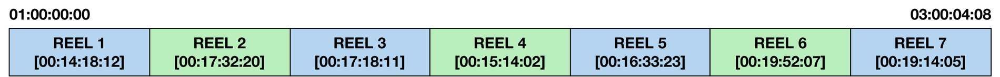
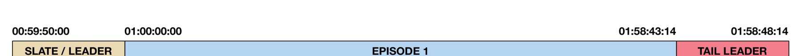
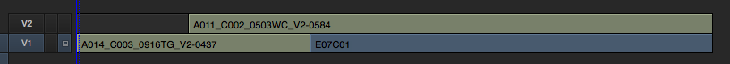

# Editorial Turnover for Digital Intermediates

Before color grading can begin, the conform editor must reconstruct the show's timeline from
camera original footage and high-quality visual effects elements using the metadata
communicated from the picture editor's offline project. This process can be very time
consuming if appropriate measures are not taken by the production editorial team to
adequately prepare their edit lists for conform. Whether they are editing in Avid, Premiere,
Final Cut Pro X, or Final Cut Pro 7,[^5] there are a number of steps they can take to expedite the
conform process and reduce time spent by the conform editor.

[^5]: There are dozens of you!

## Timeline Preparation

### Working in Reels

Studio features are still completed in reels averaging around 20 minutes each. The number of
reels is determined by the total run time of the film. This practice dates back to negative
assembly and film prints. Even though you are finishing the film digitally, the film print cannot
exceed the length of a roll of print stock. The standard length of 35mm print stock is 2000 feet
(roughly 22 minutes at 24 fps).

Despite most films no longer producing film prints en masse, and nearly all independent features
exhibiting exclusively digitally, it is still common practice to work in reels. This is a practice that
may fade away in time, but it is currently the standard. In team-based editorial or color grading
environments, it is particularly useful to work in reels so that one editor or colorist can be
working in one reel while an associate is working in another. Reel-based division of a film
allows for parallelization of labor and usually improves overall efficiency. However, if there is
only one editor, or only one colorist, it may be easier to work with the film in a single, fully
assembled, longplay sequence.

This decision is up to the production and their picture and sound vendors' preferences.
Ultimately the film will be assembled into a longplay sequence prior to distribution and
exhibition.

In the case of episodic television or web content, an individual episode is not typically subdivided
and is instead treated as a single sequence.

### Leaders and Tail-Pop

Reels usually begin on the hour representing their reel number (e.g. Reel 1 at 01:00:00:00).
Because picture and sound finishing are separate processes that must be married together at
the end of the post-production process and are carried out by different teams, regularly at
different companies, it is important to provide sync references to accurately and quickly match
audio with picture.

The standard eight-second Academy leader starts each reel or sequence and counts down to a
two-pop which will visually correspond with an audio pop in the temp and final mixes. The
two-pop gets its name because it is followed by two seconds of black before the first frame of
picture (FFOP).

At the end of the reel or sequence, two seconds after the last frame of picture (LFOP) is a
tail-pop. This is a way of visually confirming that the picture was intended to end there and did not
end prematurely, and that the audio is indeed still in sync.

Without leaders and pops it is difficult to ensure accurate sound sync, because you rely on the
operator marrying the audio and picture tracks to sync audio subjectively. Production audio,
foley, and sound effects could be off by as much as a frame or two either intentionally or
accidentally, so those should only be used for sync as a last resort.

<figure class="mosaic-fig" markdown>
--8<-- "figures/svg/figure-05-reels.svg"
  <figcaption>Figure 5 — Example reel-based composition of a feature length film. Each reel begins
  on its own hour with an eight-second head leader (192 frames) and closes with a four-second
  tail leader (96 frames).</figcaption>
</figure>

<figure markdown>
  { loading=lazy }
  <figcaption>Figure 6 — Example longplay composition of a feature length film.</figcaption>
</figure>

<figure markdown>
  { loading=lazy }
  <figcaption>Figure 7 — Example composition of a premium cable or OTT commercial-free
  television episode, with a 240-frame slate/leader and a 120-frame tail leader.</figcaption>
</figure>

### Simplifying Timelines

Once an edit is locked, it is usually the duty of the assistant editors (or the editor if there are no
assistants) to tidy up the timeline and prepare it for the conform. This involves consolidating
tracks down to as few tracks as necessary without altering the resulting edit. Pruning
unnecessary tracks or redundant clips, as well as joining through edits, is helpful in
reducing conform time.

Decompose all nested sequences and multicam clips. Many conform systems do not handle
nested clip metadata correctly, and this can be cause for a conform editor to reject the turnover
and request revisions from the production editorial team.

Creative resize and reposition effects should be completed using the native tools within the
editing software whenever possible, as those can often be translated accurately across XMLs or
AAFs, saving the conform editor time in recreating optical effects.

It is common for editors to work in organically composed timelines that fit their individual
working styles. This can involve multiple layers of clips overlapping each other to produce the
intended edit. This is great for the creative process, but can complicate the conform process.

Imagine you have a clip that completely covers another clip on a track below it.

<figure markdown>
  { loading=lazy }
  <figcaption>Figure 8 — A multi-layer composition.</figcaption>
</figure>

You will never see the bottom clip, as it isn't the topmost clip at any time in the sequence.
However, if you turn over edit lists to a digital intermediate facility, they are going to pull all of
those shots online. Sometimes that is as simple as copying files from your hard drive to their
servers or unarchiving from an LTO archive. It could also involve transcoding and preparing the
Camera RAW media in a different format depending on your show's workflow. Either way, that
is unnecessary work that is ultimately billable back to you as the client and serves no benefit.

It is important that timelines prepped for DI are flattened and simplified to as few layers as
possible.

### Organize Timeline Layers by Type

Depending on the preferences of the conform editor and the particular characteristics of the
project, the way you organize the timeline layers in the turnover can vary. It is good to
collaborate with the conform editor and come to an agreement on an organizational strategy
that benefits you both the most.

A common, simple example for timeline layout is as follows:

| Track | Contents |
| --- | --- |
| V5 | Titles and graphics |
| V4 | Visual effects provided by external vendors |
| V3 | Additional optical plates if necessary (B-sides for split comps) |
| V2 | Opticals (to be completed by the conform editor) |
| V1 | Scans (Original Camera Negative [ONEG], drama, unaltered camera footage) |

If multiple plates are necessary to complete a complex optical, and it is intended to be handled
in conform editorial rather than with an external VFX vendor, layering those necessary plates
on top of each other makes sense. In this example you would have two or more layers
dedicated to opticals before the visual effects and title layers.

## Edit List Generation

There are several common interchange formats that are compatible with most, but not all,
digital intermediate systems. Communicate with your conform editor about what format they
prefer and how best you can prepare that for them.

Regardless of the edit list flavor you choose, an important universal requirement is that the clips
in your project and timeline correlate to the camera original media through a tape name and
timecode relationship. In the case of major digital cinema cameras, this is relatively
straightforward and has been planned for by the manufacturers. Each take is named using a unique
identifier based on its camera roll, clip number, and sometimes the date and specific camera
serial number it was recorded with. The specifics vary between manufacturers, but
nevertheless, these systems were built with post-production in mind. The tape name and
timecode can often be derived from the source file's metadata as well.

Whichever source you use for the tape name metadata, it is important to make sure that
information is available to the conform editor in the original media they are given so that they
can match to those files quickly and accurately.

In cases where there is no reliable tape name, such as GoPro or specialty cameras not designed
with offline/online post-production workflows in mind, it is important that the DIT or editorial
team produce a unique reference that will translate to the conform. This can be done by
manually producing unique file names for each clip during DIT ingest and dailies processing.
This is particularly important in instances where camera timecode is regenerated at the start of
each clip (e.g. each clip starts at 00:00:00:00). It will be difficult to conform a sequence if a
timeline clip matches dozens of source clips, all without unique tape names and all starting with
the same timecode.

It is also critical to maintain a common time base between footage and editing timelines. For
example, mixing 24.000 fps footage with 23.976 fps footage on a 23.976 fps timeline can produce
timecode errors that increase the complexity of the conform. The majority of American feature
film productions are recorded and edited at 23.976 fps.

### EDL

CMX-style EDLs, or Edit Decision Lists, are the oldest and simplest edit list, dating back to
tape-to-tape linear online editing systems. They are incredibly universal and all digital intermediate
systems can accept them. They are, however, limited in a number of ways. EDLs cannot describe
variable speed ramps, only static timewarps where speed does not change over time. EDLs
cannot describe resize/reposition effects, flips, or flops. Support for multi-layered EDLs varies
from platform to platform, but in general they are not recommended. Typically, each layer in
the offline edit must be exported as an individual EDL file.

The advantages of EDLs are that they are universally accepted and easily human readable. This
makes procedural corrections and adjustments to troublesome conforms rather easy in most
cases. EDLs can also contain ASC CDL (Color Decision List) data in convenient EDL comments.

### XML

In the context of digital intermediate finishing, "XML" typically refers to the Final Cut Pro 7 XML
Interchange Format, adhering to the interchange specifications defined by Apple. These are the
standard XMLs produced by both FCP 7 and Adobe Premiere. XMLs support a variety of image
effects, including, but not limited to, resize and reposition. They also support speed ramps,
although these may be interpolated differently by the DI system and require finessing by the
conform editor. XMLs support multi-layer timelines.

XMLs are human readable text, but are not always easy to edit quickly.

### AAF

A SMPTE open standard primarily utilized by Avid for picture and audio turnovers, also used by
other editing systems for audio turnover to Pro Tools. AAFs contain much of the same metadata
as an XML. AAFs produced by Avid Media Composer 8 or later include baked keyframe data for
speed ramps. This is particularly helpful in producing accurate time ramps in the conform
process without having interpolation discrepancies between keyframes. AAFs support
multi-layer timelines. AAFs are stored as binary data and are not human readable or editable.[^6]

[^6]: Under standard human conditions.

### FCPXML

A newer flavor of XML used by Final Cut Pro X. Compatible with Blackmagic DaVinci Resolve, but
not with all other conform systems. Contains many improvements upon FCP 7 XMLs, including
ASC CDL support. FCPXMLs support multi-layer timelines.

### OTIO

**OpenTimelineIO (OTIO)** is an open-source interchange format and API for editorial timelines —
originated at Pixar and now an Academy Software Foundation (ASWF) project. Unlike the formats above,
each tied to a particular NLE lineage, OTIO is designed as a **vendor-neutral interchange and a
programmable data model**: a JSON-based timeline (`.otio`) plus a set of adapters that read and write
EDL, FCP7 XML, AAF, FCPXML, and more, so it can act as a hub that translates between them.

Adoption is strongest on the **pipeline and engineering** side rather than the artist-facing one. It
is widely used inside studio and VFX pipelines (it ships with or is supported by Nuke Studio/Hiero,
RV, Autodesk Flow/ShotGrid, and many in-house tools) and has broad library support — but native
**save-as-OTIO from mainstream NLEs is still limited**. DaVinci Resolve has added OTIO import/export,
while Avid Media Composer and Premiere still lean on their traditional formats. In practice, for an
independent conform in 2026 you will still most often hand the DI an EDL, XML, or AAF; OTIO's real
value today is as the **programmatic glue** for translating, comparing, and validating those lists,
and its role is growing.

### Choosing a format — what each can carry

Every one of these formats carries the same non-negotiable core: the **clip list with a source tape
name and timecode**, which is what a conform cannot do without. Beyond that shared core they diverge:

| Capability | EDL | FCP7 XML | AAF | FCPXML | OTIO |
| --- | :---: | :---: | :---: | :---: | :---: |
| Human-readable | ✓ text | ✓ verbose | ✗ binary | ✓ verbose | ✓ JSON |
| Tape name + timecode | ✓ | ✓ | ✓ | ✓ | ✓ |
| Multi-layer timelines | ✗ one/file | ✓ | ✓ | ✓ | ✓ |
| Resize / reposition | ✗ | ✓ | ✓ | ✓ | ✓ |
| Variable speed ramps | ✗ static only | ✓ interpolated | ✓ baked keyframes¹ | ✓ | ✓ |
| ASC CDL color | ✓ in comments | ✗ | ~ | ✓ | ✓ |
| Origin / lineage | CMX tape online | FCP7 · Premiere | Avid · Pro Tools | Final Cut Pro X · Resolve | ASWF (Pixar), cross-NLE |
| DI acceptance | ✓ universal | ✓ common | ✓ common | ~ Resolve+ | ~ via adapters |

<small>¹ Baked speed-ramp keyframes in AAFs from Avid Media Composer 8 or later.</small>

In short: EDL is the lowest common denominator — one layer, no effects, but universal and
editable; XML and FCPXML add layers and effects; AAF adds baked speed ramps (at the cost of being
binary); and OTIO spans all of them as a translating hub rather than a native turnover format.

!!! tip "List-management tooling"
    Wrangling, comparing, and repairing edit lists by hand is error-prone. Video Village's
    [DI tools](https://ditools.videovillage.com) include **EDL and list-management utilities** for
    exactly this — inspecting, cleaning, and reconciling lists before they reach the conform.

## Conform Checks

Critical to the conform process is a visual comparison between the offline cut and the final
conform. This is how the conform editor visually verifies that the conform is accurate. During
the "conform check" or "confidence check" process, they can identify any incongruities
between the conform and the intended edit, including temporal discrepancies and missing
opticals or transitions that may not have translated from the edit list correctly.

The offline reference is a same-as-source QuickTime export from the offline editing application,
typically DNxHD 36 or Apple ProRes. Occasionally H.264s are used; however, they are
discouraged because MPEG motion artifacts can produce visual incongruities that would be
flagged as potential temporal discrepancies, making it difficult to use as an accurate reference.

### Offline QuickTime Reference

The provided offline QuickTime reference is essential in the initial conform process. As the edit
changes — rarely is an edit truly locked — additional check QuickTimes will be provided by
production editorial to the DI to verify picture changes.

At some point during the DI, either following a significant milestone or cut change, it is
advisable for the conform editor or colorist to render a DNxHD or ProRes QuickTime of the edit,
with or without temp color grading, optionally including source clip name and timecode burn-in,
and send it to the production editorial team. They will then perform their own visual inspection
and verify that the DI conform matches their offline edit as expected.

It is also useful to export an EDL of the DI timeline for the production editorial team to verify.

## Opticals List

Many basic effects are easily reproduced during the conform process. These effects are usually
resize, reposition, stabilization, flips, flops, simple timewarps, dissolves, effect transitions, and
locked-off split-screen composites. These effects are commonly referred to as "opticals"
because they required the use of optical printing in the days of negative assembly conforms.
Depending on the complexity and volume of shots, they may be delegated to a dedicated VFX
artist or vendor.

It is important to identify these shots for the conform editor and provide notes on what the
desired effect is and whether you want them to precisely match your offline reference or make
improvements upon it.

These lists can be produced and communicated a number of different ways, including timeline
markers, locators, or other comments in an edit list, or even a simple spreadsheet listing event
timecode and descriptions.

## Media Consolidation and Delivery

Major studio features utilize LTO tape archives containing their camera original media. These
are usually managed and stored in their digital intermediate vendor's vault during production
and throughout the DI. This facilitates easy clip pulls for dailies transcoding, visual effects, and
ultimately the onlining and conform of the final edit for color grading. This is common as most
production companies do not have the infrastructure to store and pull shots as quickly or
efficiently as large facilities.

However, independent productions typically assume responsibility for the storage and archival
of their production assets — usually on redundant external hard drives. Even small productions
shooting with multiple cameras and recording Camera RAW often span multiple archival drives
by the end of production. When it comes time to turn media over to a digital intermediate
facility or independent colorist, it is important to consolidate the original media necessary for
the conform to as few drives as possible. Trimming media with handles, or simply isolating only
the necessary source clips, can massively reduce the amount of data I/O time required to ingest
the media at the facility. These are tasks that can sometimes be completed by assistant editors
at production editorial. Delivering disorganized media spanning across multiple drives will only
increase the amount of time a facility or independent operator needs to conform the project
and ultimately the cost associated with it.

## Delivering VFX to DI

It is common for editorial to follow the initial DI conform turnover with subsequent change
notes and visual effects updates. Those subsequent list turnovers may or may not include a new
offline reference QuickTime if there are no timing changes and the visual effects shots have a
usable temporal sync reference. If timing can still be visually confirmed using the original offline
reference, a new one is not necessary unless requested.

Edit lists delivered containing visual effects shots must exactly match the complete VFX shot
name, including version as delivered from the VFX vendor, in order to facilitate an accurate
conform. It is important that the timecode of the VFX clips in the offline NLE matches the
timecode of the files presented to the DI, using header timecode, or more commonly the frame
number, as agreed upon by the DI. It is a common problem that QuickTimes from the VFX
vendor may not reflect the accurate timecode, or the NLE interprets it incorrectly. This can be
troublesome for a DI and should be tested early on before many shots are delivered.

## Common Issues and Solutions

It is not uncommon for details to be lost in translation during a conform. Specific effects
produced in the offline NLE often cannot translate across XMLs or AAFs and rarely translate
across EDLs at all. Additionally, tape names or clip names may be close matches to the original
media, but may require a little tailoring by the conform editor to make it work with their
individual workflow. It is recommended to provide EDLs in addition to XMLs or AAFs so that
there is a redundant supply of metadata in case something doesn't work correctly with the XMLs
or AAFs. This reduces the amount of downtime and troubleshooting between the DI and
production editorial.

Supplying the conform editor with a copy of the NLE project containing the turnover timeline
can be of help if the conform editor has access to and is familiar with the same NLE production
editorial uses. This project does not necessarily need to include media files and is helpful as a
reference in cases where metadata in the EDLs, XMLs, or AAFs is not linking back to original
media correctly.
