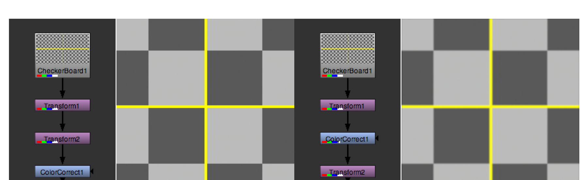
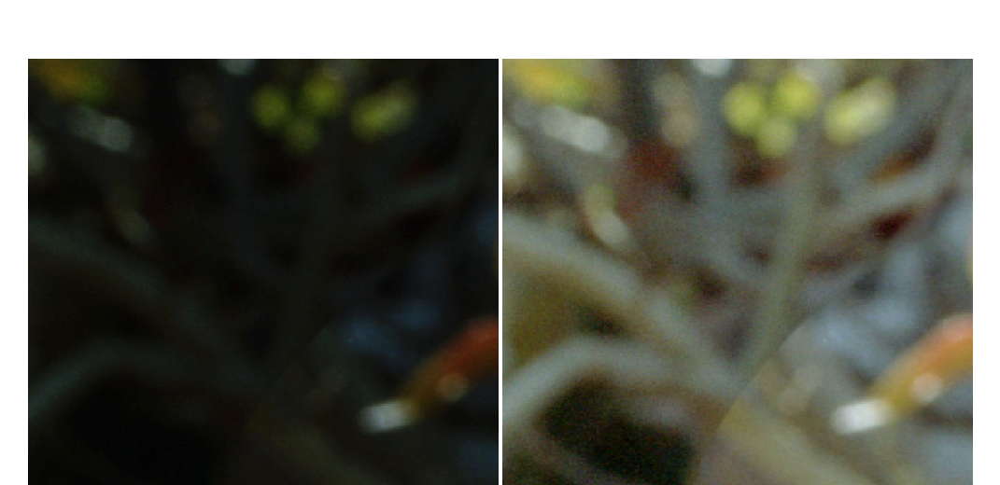
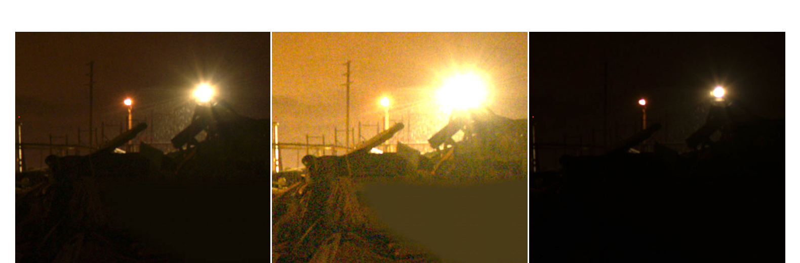
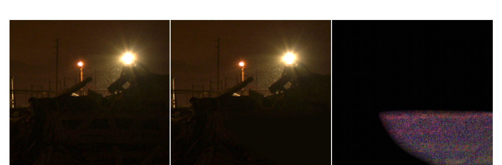

# Visual Effects Quality Control Practices

!!! quote
    "One unfortunate reality in film production is that the typical artist display is
    not as high fidelity as the eventual theatrical viewing environment; most often
    the theatrical audience will see more color detail than the original artist."

    — Jeremy Selan, Sony Pictures Imageworks, *Cinematic Color VES*, 2012

One of the major tenets of visual effects is *do no harm*. This goes to say that visual effects
work should always contribute a positive and productive effect to the final image, but not to
the detriment of the image in any other way. Of course, we are not talking subjectively here,
but rather on a technical/objective level.

Inexpertly composited visual effects can introduce unintended side effects that detract from an
image's objective quality. These issues manifest themselves in a variety of ways and can stem
from a number of potential mistakes in image processing before, during, and after compositing.
Building and vetting a robust imaging pipeline is critical to preserving image integrity and
fidelity.

This is often the job of the technical director (TD) at a visual effects studio. It is important to
clearly define expected results early in pre-production. When all parties know what results are
expected and what practices are being prescribed, and all follow those protocols, the result is a
homogeneous and streamlined visual effects process.

On independent productions where there is no TD, these responsibilities often fall on the
shoulders of the VFX supervisor or the lead VFX artist on the project. The production's resident
imaging expert should define and vet the visual effects workflow and imaging pipeline to detect
any weaknesses or points of failure prior to production. As issues arise, it is important for the
VFX artists or vendors to establish dialogue with production to troubleshoot.

## Image Processing Practices

### Scaling Algorithms

Spatial scaling transformations result in the remapping of original pixel values to new positions in
the image. Different scaling algorithms provide different solutions to where and how those
values should be remapped and whether they should be smoothed and interpolated. Many
issues can arise from using computationally "cheaper" scaling algorithms in compositing, such
as aliased or jagged edges.

Impulse and nearest-neighbor scaling algorithms are prone to producing noticeable aliasing and
distortion, but are computationally inexpensive.

Better, smoother scaling algorithms result in softer edges with fewer scaling artifacts, but are
more computationally intensive.

Many scaling algorithms introduce a degree of sharpening to produce apparent resolution gain
when positively scaling an image. Many of these filters (negative-lobed filters such as Rifman
and Lanczos, for example) are prone to producing ringing artifacts in areas of high contrast.
Many scaling operations produce major artifacts on floating-point images containing negative
values.

Because of this, most scaling operations are best not performed in scene-linear. Even within
applications like Nuke, which natively work in scene-linear, scaling operations take this into
account and apply transfer functions to remap the image to a more suitable encoding prior to
scaling, and then back to its original encoding without clamping.

This is worth considering when processing scene-linear visual effects pulls to OpenEXR, or when
scaling scene-linear OpenEXR visual effects in a DI. If scaling is producing exceptional ringing
artifacts, the software performing the scaling may not be de-linearizing automatically and a
manual pre- and post-scaling conversion may be necessary. Any scaling being performed to
resize the camera original image to the visual effects pull format should be performed in a
logarithmic space rather than in scene-linear, even if the source and destination formats are
scene-linear.

The same principles apply to titles and graphics compositing in a digital intermediate.

### Concatenated Image Transforms

Many processes in compositing require complex image resizing and repositioning to achieve a
desired result. This may involve multiple successive image transforms. Every time an image is
resized or repositioned, some of the original image sharpness is degraded. After multiple
successive transformations, the end result could be noticeably softer looking than the original
plate.

For this reason, many compositing packages provide solutions that concatenate image
transformations, essentially boiling down multiple successive transformations into a single net
transformation operation. This is done behind the scenes, but there are many ways that an
artist can break the concatenation, such as applying color correction processes or image
shaders in between transform operations.

In the example below, `Transform1` is scaling by a factor of 0.10 and `Transform2` by 10.0, for a
net-zero scaling transform. In the example on the left the transforms are concatenated before
the `ColorCorrect` node, resulting in a color corrected image of the original net-zero transformed
image. On the right, the `ColorCorrect` node bisects the transforms and breaks the
concatenation. The result is an image with substantial loss of sharpness.

<figure markdown>
  { loading=lazy }
  <figcaption>Figure 20 — Left: both Transform1 and Transform2 occur before color correction.
  Right: Transform2 occurs after color correction, breaking concatenation.</figcaption>
</figure>

### Transfer Functions

It is common for compositing to be performed in a working space other than the original plate
or delivery-specified encoding(s). Strict color management throughout the compositing process
is necessary to ensure that the final delivery is in the desired color space and that no loss of
dynamic range has occurred. Compositing is often best performed in a scene-linear working
space where math operations function predictably and linearly, rather than in a logarithmic or
gamma-referred working environment.

Compositing packages like Foundry's Nuke are designed around compositing in a linear
working space by applying floating-point transfer functions to pre-convert material from
camera-native logarithmic encoding to scene-linear and then back to a chosen destination
encoding on render. This all works because the transfer functions are mathematically
reversible, are not "s-shaped" display-referred transforms, and are performed in high precision
32-bit float.

Other compositing packages[^20] coming from different pedigrees have different philosophies
about desired working spaces and color management practices. Conducting end-to-end
workflow tests in pre-production is paramount to identifying and resolving potential issues and
deciding on a workflow that yields the best results.

[^20]: Here's looking at you, After Effects.

## Quality Control Practices

Instituting a personal practice of checking your own work is key to success. Nothing is more
embarrassing than having to redeliver a shot because of a mistake that would have been caught
in a simple review. Checking for render dropouts, matte edges, color shifts, and issues in file
naming, numbering, and render formatting is important before any files are delivered to the
production (or client). Major studios follow this practice in a hierarchical fashion, with the
senior compositing supervisors and visual effects supervisors performing critical review of all
artist-submitted shots in a theater or other calibrated screening environment. They may have
software systems in place for detecting issues like missing frames, but a visual inspection is
crucial for detecting compositing issues. They examine not only the composited area, but all
areas of the frame for potential mistakes and side effects. Comparison of previous versions of
the shot as well as the original plate is helpful in detecting and analyzing issues. Not only do
they examine individual shots, but sequences as a whole, which are often produced through
the talents of multiple artists. Making sure that comparable elements throughout a sequence
match in continuity is critical to maintaining quality.

Many composited images look great when viewed in their target viewing space on the display
they were composited on. However, those shots will ultimately undergo — sometimes
significant — color grading and ultimately will be viewed on consumer displays under less than
ideal conditions.[^21] Under those conditions, masks with unfeathered edges, differences in noise
and grain patterns, and changes in shadow density and black points become significantly more
apparent.

[^21]: Sports mode, anyone?

Any artist, regardless of project scale, can benefit from adopting many of these practices in
their personal work.

### Gamma Checking

A common and quick way to identify matte lines and issues in noise, grain, and black point
matching is by simply increasing and decreasing the compositor's viewport gamma by a
significant amount, much more than you would expect it to ever be viewed in. This is a common
technique used by studio QC operators when checking a final deliverable before it is put into
distribution.

<figure markdown>
  { loading=lazy }
  <figcaption>Figure 21 — Left: composited image under normal viewing conditions.
  Right: gamma increase reveals hard matte lines.</figcaption>
</figure>

### Exposure Checking

Additionally, linear increases in exposure can provide artists with a sense of the real dynamic
range of their image. Do artificial (composited or CGI) highlights clip or read at the same level as
comparable highlights in the original plate? Do artificial shadows match the black point (color
and value) of comparable shadows in the plate? How do these values compare within the shot
and to other shots nearby?

<figure markdown>
  { loading=lazy }
  <figcaption>Figure 22 — Left: composited image under normal viewing conditions.
  Middle: exposure increase reveals black point mismatch in composite.
  Right: exposure decrease demonstrates highlight detail.</figcaption>
</figure>

### Difference Checking

Performing a high-gain mathematical difference operation between a visual effects render and
an original plate can reveal a variety of compositing issues that may not be visible to the naked
eye, including matte lines, noise/grain patterns, tracking issues, and highlight/shadow
compression or clamping.

<figure markdown>
  { loading=lazy }
  <figcaption>Figure 23 — Left: original plate. Middle: composite. Right: difference check reveals
  a mismatch in film grain between plate and comp.</figcaption>
</figure>
